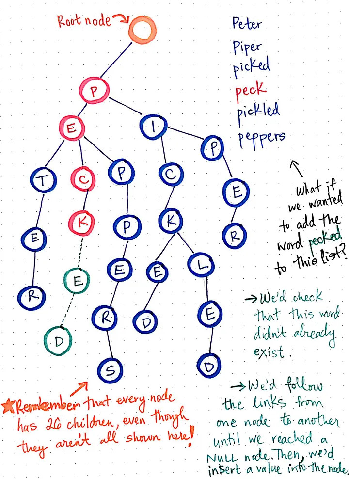
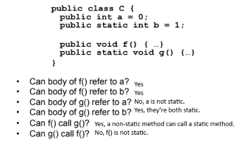

<h1 align="center">THE CS COMPENDIUM</h1>
  <p align="center">
    A summary of general information
	for programming technical interviews.
    <br />
  </p>
</div>

# TABLE OF CONTENTS

<ol>
	<li><a href="#about-the-project">About the Project</a></li>
	<li><a href="#data-structures">Data Structures</a></li>
	<li>
		<a href="#algorithms">Algorithms</a>
		<ul>
			<li><a href="#complexity">Complexity</a></li>
			<li><a href="#algorithm-concepts">Algorithm Concepts</a></li>
			<li><a href="#uncategorized-algorithms">Uncategorized Algorithms</a></li>
			<li><a href="#pattern-matching">Pattern Matching</a></li>
			<li><a href="#divide-&-conquer">Divide & Conquer</a></li>
			<li><a href="#dynamic-programming">Dynamic Programming</a></li>
			<li><a href="#backtracking">Backtracking</a></li>
			<li><a href="#greedy">Greedy</a></li>
			<li><a href="#searches">Searches</a></li>
			<li><a href="#sorts">Sorts</a></li>
		</ul>
	</li>
	<li><a href="#object-oriented-programming">Object Oriented Programming</a></li>
	<li><a href="#multithreading">Multithreading</a></li>
	<li><a href="#database-design">Database Design</a></li>
	<li><a href="#system-design">System Design</a></li>
	<li><a href="#design-patterns">Design Patterns</a></li>
	<li><a href="#web-design">Web Design</a></li>
	<li><a href="#concepts">Concepts</a></li>
	<li><a href="#interview-methodology">Interview Methodology</a></li>
</ol>
  
# ABOUT THE PROJECT

Technical interviews suck. When I started my preparations for them, I was immediately overwhelmed by the sheer breadth of information that a software engineer is required to know just to be considered employable. I started documenting everything I was learning and relearning as a quick reference guide. Based on my observations, this is a general coverage of topics that one might reasonably expect to encounter in an interview. Please note that this is geared towards a mid-level software engineer. Less will be expected of junior devs and more will be expected of senior devs. Study accordingly.

Much of what is written here is content from across the web. There are many areas that are my own summaries of readings simplified to the most layman terms, but ultimately this is more of a compilation of others' writings. I've done my best to retroactively link to sources both for credit and further reading, but this is really just a document for myself and I don't wish to advertise it as anything more. I'm no authority; I encourage you to research everything here for yourself. If I got something wrong, tell me about it or submit a pull request. Do the same if you'd like to add more information or clear up some wording. Just remember to keep things simple and brief.

This document is not finished and is actively being worked on. Structure and wording throughout can be expected to change over time. Cheers.

<p align="right">(<a href="#table-of-contents">back to top</a>)</p>


# DATA STRUCTURES

> Know the concepts, how to code, how to mutate, and where to use what (performance).

> **[https://www.geeksforgeeks.org/data-structures/](https://www.geeksforgeeks.org/data-structures/)**

[**Array:**](https://www.geeksforgeeks.org/array-data-structure/?ref=shm) Basic means of storing data that can be accessed by index.

-   **Advantages:** Random access, cache locality (all elements are stored next to each other in memory, local to one another. This means when a chunk is brought into a cache, there’s a good chance the cache will hit the needed value, saving cpu time)
-   **Disadvantages:** Can’t change the size after declared (this can be remedied by using lists), slow to insert and remove when not at the end of an array.


[**Linked List:**](https://www.geeksforgeeks.org/data-structures/linked-list/?ref=lbp)  A data structure that allows you to take your values and chain them together by having the memory location of one value point to the memory location of the next. Linked Lists can further be used for less abstract data structures such as stacks and queues. Generally, linked lists are used when you need a lot of ordered insertions or deletions in the middle of your data structure. Typical functions include search, insert, and remove. Avoid the edge case of adding a node to an empty list by using a dummy node (a throw-away node that points to the head).
-   **Advantages:** Not needing to know the size of the linked list prior to its declaration, and better performance for insertion and deletion.
-   **Disadvantages:** No random access (have to access elements sequentially by traversing the entire list), extra memory space is required for each element’s pointer, not cache friendly (the pointers can be anywhere in memory)... Basically any interaction with a linked list involves traversing the entire list until the element in question is found. It’s great for when a lot of changes need to be made but not great when you need to read from the data frequently.
-   **Doubly Linked List:** Can move or traverse the linked list in both directions. Only modification is that Node also contains a prev attribute.
-   **Circular (Singly/Doubly) Linked List:** A Linked List where the last node points to the first. Only modification is that the last node points to the first.
	-   **Advantages:** The entire list can be traversed starting from any node and there are fewer edge cases as all nodes have a before and after node.
<p align="center">
  
</p>

[**Stack:**](https://www.geeksforgeeks.org/stack-data-structure/) Data goes First In Last Out. Common for any problems involving backtracking. Typical functions include peek, push, and pop.
-   **Monotonic stack:** Keeps elements in increasing or decreasing order by permanently popping off stored elements until the new element can be placed. A decreasing stack will find the next largest, and vice versa.

[**Queue:**](https://www.geeksforgeeks.org/queue-data-structure/)  Data goes First In First Out. Typical functions include peek, enqueue, and dequeue.
-   **Deque:** A queue that allows for enqueue and dequeue from either end.
-   [**Priority Queue:**](https://www.geeksforgeeks.org/priority-queue-set-1-introduction/) Inserts elements into a queue at different positions based on priority values. Only relies on order of insertion when two elements share the same priority. Typically implemented using a heap.
-   **Monotonic Queue or Deque:** Used in sliding window problems when you’re required to maintain some property (like the minimum, maximum, or sum) over a sliding window of fixed size across an array. Think of these if you need to keep track of the max or min in a range.

**Hash Table:** A hash table is a higher order data structure that revolves around the concept of a value and its associated key that are stored and retrieved using a concept known as hashing. Your key will be hashed (put through some algorithm) which will produce an index. Your value will then be placed in that index. If two keys are hashed and produce the same index, there’s a collision. This can be remedied with either Seperate Chaining (each index’s value is a linked list of all values under it) or Open Addressing (keep probing the later indexes by some means until you find an open one).

[**Trees:**](https://www.geeksforgeeks.org/introduction-to-tree-data-structure-and-algorithm-tutorials/) A hierarchical structure that is used to represent and organize data in a way that is easy to navigate and search. Trees are useful when you want to store hierarchical data such as a file structure system. They also offer efficient searching, forming the basis for all search algorithms. *(More on trees in the “Algorithms” section)*

> Terminology
> * Root – The top node in a tree.
> * Parent – The converse notion of a child.
> * Siblings – Nodes with the same parent.
> * Descendant – a node reachable by repeated proceeding from parent to child.
> * Ancestor – a node reachable by repeated proceeding from child to parent.
> * Leaf – a node with no children.
> * Edge – connection between one node to another.
> * Path – a sequence of nodes and edges connecting a node with a descendant.
> * Level – The level of a node is defined by the number of connections between the node and the root.
> * Height – The height of a node is the number of edges on the longest downward path between the root and a leaf.

-   [**Tree Traversal and Rotation**](https://www.geeksforgeeks.org/dfs-traversal-of-a-tree-using-recursion/)

	> [https://stackoverflow.com/questions/9456937/when-to-use-preorder-postorder-and-inorder-binary-search-tree-traversal-strate](https://stackoverflow.com/questions/9456937/when-to-use-preorder-postorder-and-inorder-binary-search-tree-traversal-strate)

	-   Pre-Order (XLR)
	-   In-Order (LXR)
	-   Post-Order (LRX)
	-   Level Order: Visit all nodes left to right, level by level

-   [**Binary Tree:**](https://www.geeksforgeeks.org/binary-tree-data-structure/?ref=lbp)  A structure where each node has **at most** 2 children. Typical functions include insert, remove, search, and traverse. Auxiliary operations include find height of tree, find level of a node, find size of entire tree. Having at most 3 children would make a ternary tree; the term is just to describe the number of children of a tree.
    
-   [**Binary Search Tree:**](https://www.geeksforgeeks.org/binary-search-tree-data-structure/?ref=shm) A structure where each parent has at most two children and all left nodes are smaller whilst all right nodes are greater. Binary Search Trees are not inherently self-balancing, (restructuring after each insertion/deletion to maintain a roughly equal level on both sides of the tree). An unbalanced tree could make operations go from O(log n) to O(n) as you’re effectively navigating your entire data set to get to the bottom of the tree.

	> [https://www.geeksforgeeks.org/difference-between-binary-tree-and-binary-search-tree/](https://www.geeksforgeeks.org/difference-between-binary-tree-and-binary-search-tree/)

-   [**Red Black Tree:**](https://www.geeksforgeeks.org/introduction-to-red-black-tree/)  A self-balancing binary search tree which has the following red-black properties:
	1.  Every node is either red or black.
	2.  Every leaf (NULL) is black.
	3.  If a node is red, then both its children are black.
	4.  Every simple path from a node to a descendant leaf contains the same number of black nodes.

	-   Red-black trees remain balanced, and thus guarantee O(logn) search times. That guarantee is why these trees are used.

	> [https://www.happycoders.eu/algorithms/red-black-tree-java/](https://www.happycoders.eu/algorithms/red-black-tree-java/)

-   [**AVL Tree:**](https://www.geeksforgeeks.org/introduction-to-avl-tree/)  Self-balancing binary search tree through rotation. Assures that the difference in height of left and right subtrees is not more than 1.
	-   The AVL trees are more balanced compared to Red-Black Trees, but they may cause more rotations during insertion and deletion. So if your application involves frequent insertions and deletions, then Red-Black trees should be preferred. And if the insertions and deletions are less frequent and search is a more frequent operation, then the AVL tree should be preferred over the Red-Black Tree.

	> 	[https://www.happycoders.eu/algorithms/avl-tree-java/](https://www.happycoders.eu/algorithms/avl-tree-java/)

-   [**B-Trees:**](https://www.geeksforgeeks.org/introduction-of-b-tree-2/)  Trees designed for lots of data. Each node can contain multiple keys, allowing for less overall nodes and therefore a shallower height. This means less disk I/O resulting in faster search and insertion/deletion operations. Each node must have a minimum number of keys to guarantee balance and therefore an operation time of O(log n). B-Trees have the following properties:
	-   Every path from the root to a leaf has the same length
	-   If a node has n children, it contains n−1 keys.
	-   Every node (except the root) is at least half full
	-   The elements stored in a given subtree all have keys that are between the keys in the parent node on either side of the subtree pointer. (This generalizes the BST invariant.)
	-   The root has at least two children if it is not a leaf.

<p align="center">
  
  <br/>
  <i><a href=https://www.cs.cornell.edu/courses/cs3110/2012sp/recitations/rec25-B-trees/rec25.html>Source: B-Trees, Cornell</a></i>
</p>

-   [**Tries:**](https://www.geeksforgeeks.org/advantages-trie-data-structure/) Used to store strings that can be visualized like a graph. Each node added waists a lot of storage on empty nodes, but means less overhead in the future. Tries are rarely used outside of spell checkers and autocomplete. You can also use them to print all words in alphabetical order. Keep Tries in mind if a problem involves large searches based on letters in a word. A trie consists of an empty root node, with one child node for each letter of the alphabet it represents (Each one starts out null). Each child can have children of its own that begin to represent words. 

	> [https://medium.com/basecs/trying-to-understand-tries-3ec6bede0014](https://medium.com/basecs/trying-to-understand-tries-3ec6bede0014)

<p align="center">
  
  <br/>
  <i><a href=https://medium.com/basecs/trying-to-understand-tries-3ec6bede0014>Source: Trying to Understand Tries, Medium</a></i>
</p>

-   [**Heap:**](https://www.geeksforgeeks.org/heap-data-structure/?ref=shm) A complete Binary Tree (all the levels are completely filled except possibly the lowest one, which is filled from the left). Can turn an unsorted array into a heap in O(n) because heapifying is different from outright sorting the list. It doesn’t need to enforce total ordering, just the heap property. The former (heap sort) takes O(nlogn). Can find the smallest/largest element in O(1). Can add/remove the smallest/largest element in O(log(n)). Can perform insertions and removals while always maintaining the first property.
	-   Max-heap: Children are always smaller than their parents
	-   Min-heap: Children are always larger than their parents

	> [https://www.programiz.com/dsa/heap-data-structure](https://www.programiz.com/dsa/heap-data-structure)

[**Graph:**](https://www.geeksforgeeks.org/graph-data-structure-and-algorithms)  Non-linear data structure consisting of vertices (nodes) and edges. It’s like a tree that doesn’t have to flow down, where each node can connect to any other node. Often, this results in cycles in the graph. A graph can also be directed, where the lines have arrows indicating some kind of order for the nodes. More on graphs in the “Algorithms” section.

<p align="center">
  
  <br/>
  <i><a href=https://www.bigocheatsheet.com/>Source: Big-O Cheat Sheet</a></i>
</p>

<p align="right">(<a href="#table-of-contents">back to top</a>)</p>


# **ALGORITHMS**

> Some of the following algorithm sections (Divide & Conquer, Dynamic
> Programming, Backtracking, and Greedy) have more to do with concepts.
> The important thing is to know where they’re applicable and how to
> implement them. Listed beneath each algorithm is a sampling of the
> most common problems where the specific paradigm is used. With some
> exceptions (such as with Dijkstra’s) these algorithm implementations
> shouldn’t be memorized. Rather, they should be reviewed to determine
> underlying concepts and observations.

> Remember to ask about the expected input size. Sometimes, the interviewer 
> will be vague, but if they do give you a range, it can be a clue. 
> For example, if n is very small, it is likely backtracking. If n is 
> around 100 - 1000, an O( n^2 ) solution might be optimal. If n is 
> very large then you might need to do better than O(n).

> **[https://www.geeksforgeeks.org/fundamentals-of-algorithms/](https://www.geeksforgeeks.org/fundamentals-of-algorithms/)**

## COMPLEXITY

[**Time and Space Complexity:**](http://bigocheatsheet.com/) How long code takes to run and how much space it takes up, respectively.
-   **Big-O Notation:** Worst case scenario for how a function runs
-   **Omega (Ω) Notation:** Best case scenario for how a function runs

[**Space Complexity:**](https://www.scaler.com/topics/data-structures/space-complexity-in-data-structure/) Each variable declared is, say, 4 bytes. Declaring any one variable would be 4 (bytes) and therefore run in O(1). If we introduce a data structure such as an array, that would be 4n (bytes) where n is the number of indices (or individual variables within the array) so it runs in O(n). Every data structure therefore runs in O(n) space complexity. Any algorithm that reduces space complexity will increase time complexity and vice versa.

Number of calls does not necessarily dictate space complexity. If a recursive function is called once but goes down n levels, each level is added to the stack, resulting in O(n) space complexity. However, if a non-recursive function makes 5 calls, they do not exist simultaneously on the call stack (each one gets trashed after being used), and can be thought of as O(1).

For space calculations, we consider only Data Space and we neglect the Instruction Space (conditionals, loops, etc.) and Environmental Stack (A() calls B() so A()’s variables are put on the stack temporarily while B() executes).

Look at the very bottom of the linked article for explanations of space time calculation for all of the sorts. The faster sorts always require more space and vice versa.

Generally, all basic data structures use O(n). 2D arrays and the like use O(n^2). Dictionaries use O(n) because they’re optimized to behave like lists.

<p align="right">(<a href="#table-of-contents">back to top</a>)</p>

## ALGORITHM CONCEPTS

**Recursion:** Recursion is made for solving problems that can be broken down into smaller, repetitive problems. It is especially good for working on things that have many possible branches and are too complex for an iterative approach. Trees and graphs are common places for recursion to be implemented. Each recursive function consists of a recursive call (to itself) and a base case (causes us to exit recursion when we have the data we’re looking for). Recursive functions are heavy on memory use (each call is added to the stack), this can be lessened by using a look-up table (memoization). 
-   **General steps:** What’s the simplest possible input? Play around with examples and visualize. Relate hard cases to simpler cases to find overlapping work. Generalize the pattern. Write code by combining the recursive pattern with the base case.


**Memoization:** Technique for optimizing run-time. In cases where we call an expensive function multiple times with the same input, we can store the results of that function’s output and instead just look up that result on the next repeated call.

    public int fibo(int n) {
        System.out.println("Calling fibonacci with input: " + n);
        
        if (n < 2) {
	        return n;
        }
        return fibo(n - 1) + fibo(n - 2);
    }

Take the recursive Fibonacci function above. Each call to fibo will make many more calls to fibo, so each call is expensive (O(2^n)). But we’re making a lot of repeated calls to numbers lower than n as it goes down the calculation. If we make a calculation for any given n, we can store that result and not need to make that expensive calculation again.

    private Map<Integer, Integer> cacheTable = new  HashMap<>();
    
    public  int  fibo(int n) {
	    if (n < 2) {
		    return n;
	    }
    
	    if (this.cacheTable.containsKey(n)) {
		    return  this.cacheTable.get(n);
	    }
    
	    int  fiboNumber = fibo(n - 1) + fibo(n - 2);
	    this.cacheTable.put(n, fiboNumber);
	    
	    return fiboNumber;
    }
    
<p align="right">(<a href="#table-of-contents">back to top</a>)</p>

## UNCATEGORIZED ALGORITHMS

**Sliding Window:** Used in array problems where you need to find some information about a *consecutive* sequence of data. Instead of a nested for loop to compare every index in an array to all indexes prior, we take a collection of indexes and slide down the array one by one. Each slide we remove the old index, add the new index, and compare the result to see if the new index is a better fit. Keywords that a problem is a Sliding Window problem are: maximum/minimum, subarray/substring.

The algorithm is: get the value of the elements that fit in the window size at the start of the array; that is the current max. Then, iterate over the elements starting from the beginning. Calculate the value by subtracting the old element (first in the list) and adding the new element that is to the right of the currently calculated values. Compare the value to the current max. Repeat.

	def fn(arr):
    left = ans = curr = 0

    for right in range(len(arr)):
        # do logic here to add arr[right] to curr

        while WINDOW_CONDITION_BROKEN:
            # remove arr[left] from curr
            left += 1

        # update ans
    
    return ans

<p align="right">(<a href="#table-of-contents">back to top</a>)</p>

## PATTERN MATCHING

> Find all occurrences of a given pattern in a given string.
> Common algorithms are Boyer-Moore, KMP, Rabin Karp, and Z Algorithm. Just choose one and memorize it.

**Boyer-Moore**

**Knuth-Morris-Pratt (KMP) Search**

**Rabin Karp**

[**Z Algorithm:**](https://www.geeksforgeeks.org/z-algorithm-linear-time-pattern-searching-algorithm/) Can be used interchangeably with KMP. We take a string s, and create an array z, containing the number of matching characters going forward. The first index is undefined, or set as 0, since a full string will always be equal to itself. For “aaabaab”, we fill in z[0] as 0. Then, we look at s[1], or ‘a’. We see how many characters moving forward (self-inclusive) match the characters from the start of s. We have ‘aa’ from s[1] and s[2] which matches the first two characters of s. Then we hit a ‘b’ so we stop, since the third character in s is an ‘a’. Now our z array now looks like z = [0,2]. The whole thing looks like [0,2,1,0,2,1,0]. 

Another example is “abacaba” where the z array starts to look like [0,0,1,0]. We then get to s[4] which is an ‘a’, and see that it and the next 2 characters match the first three of the string (‘aba’) so our z = [0,0,1,0,3]. Finishing it out, it looks like z = [0,0,1,0,3,0,1].

How we use this is to create a Z array for a string “P$T” where P is pattern, $ is a special character that should not be present in both pattern and text, and T is text to search. Any number in Z that is equal to the size of P indicates a full match to the pattern at that location. For example:

> Pattern P = "aab", Text T = "baabaa"
> 
> The concatenated string is = "aab$baabaa"
> 
> The Z array for the above concatenated string is
> 
> {x, 1, 0, 0, 0, 3, 1, 0, 2, 1}.

Since the length of the pattern is 3, the value 3 in the Z array indicates the presence of a pattern.

> [https://personal.utdallas.edu/~besp/demo/John2010/z-algorithm.htm](https://personal.utdallas.edu/~besp/demo/John2010/z-algorithm.htm)

## DIVIDE & CONQUER

Divide and Conquer works by dividing a problem into smaller sub-problems, conquering (solving) those sub-problems recursively, and combining the solved sub-problems to get the final solution of the problem. The general algorithm is:

    DAC(a, i, j){
    	if(small(a, i, j))
    		return(Solution(a, i, j))
    	else
    		mid = divide(a, i, j) // f1(n)
    		b = DAC(a, i, mid) // T(n/2)
    		c = DAC(a, mid+1, j) // T(n/2)
    		d = combine(b, c) // f2(n)
    	return(d)
    }

**Examples are Binary Search, Merge Sort, and Quick Sort**

> [https://www.geeksforgeeks.org/divide-and-conquer/?ref=shm](https://www.geeksforgeeks.org/divide-and-conquer/?ref=shm)

<p align="right">(<a href="#table-of-contents">back to top</a>)</p>

## DYNAMIC PROGRAMMING

Dynamic programming works when we have an overlapping subproblems structure where the answer to a subproblem is needed for solving several other subproblems. We store the solutions to subproblems to save on calculation time when the same problem comes up again (memoization). 

Dynamic programming can be thought of as an extension of Divide and Conquer. Both look to solve problems that involve many subproblems, but a solution becomes dynamic programming when we use memoization/when the subproblems overlap.

Hints that a problem may be DP include needing to find the maximum or minimum of something or having to make decisions that might look different depending on decisions we made previously.

Solving and fully understanding a dynamic programming problem is a 4 step process:
1. Start with the recursive backtracking solution
2. Optimize by using a memoization table (top-down dynamic programming)
3. Remove the need for recursion (bottom-up dynamic programming)
4. Apply final tricks to reduce the time / memory complexity

> [https://www.geeksforgeeks.org/dynamic-programming](https://www.geeksforgeeks.org/dynamic-programming)
> [https://algorithm-visualizer.org/](https://algorithm-visualizer.org/)

**Examples are Bellman-Ford’s Shortest Path, Fibonacci Sequence, Floyd-Warshall’s Shortest Path, Integer Partition, 0/1 Knapsack Problem, Longest Common Subsequence, Longest Increasing Subsequence, Longest Palindromic Subsequence, Maximum Subarray, Maximum Sum Path, Pascal’s Triangle, Shortest Common Supersequence, Ugly Numbers**

<p align="right">(<a href="#table-of-contents">back to top</a>)</p>

## BACKTRACKING

Backtracking is like trying different paths, and when you hit a dead end, you backtrack to the last choice and try a different route. It involves finding a solution incrementally by trying different options and undoing them if they lead to a dead end. It is commonly used in situations where you need to explore multiple possibilities to solve a problem, like searching for a path in a maze or solving puzzles like Sudoku. When a dead end is reached, the algorithm backtracks to the previous decision point and explores a different path until a solution is found or all possibilities have been exhausted. It explicitly does this using recursion.

Generally every constraint satisfaction problem can be solved using backtracking but there are a vast number of problems that can be solved using Greedy or Dynamic programming in logarithmic or polynomial time complexity which is far better than the exponential complexity of Backtracking. After all, Backtracking is basically brute force. However, many problems still exist that can only be solved using Backtracking.

For example, let’s say we have 3 boxes and we need to find the box with a gold coin in it. There’s no overlapping subproblems here as each box is independent so DP does not work. The odds of each box containing the coin is the same, so we have no differing weights to go off of for Greedy.

Technically, for backtracking problems:
-   The algorithm builds a solution by exploring all possible paths created by the choices in the problem. This solution begins with an empty set S={}.
-   Each choice creates a new sub-tree ‘s’ which we add into our set.
-   Now there exist two cases:
	-   S+s is valid set
	-   S+s is not valid set
-   In case the set is valid, we make more choices and repeat the process until a solution is found. Otherwise, we backtrack our decision of including ‘s’ and explore other paths until either a solution is found or all possible paths are exhausted.
```
    void FIND_SOLUTIONS(parameters):
        if (valid solution):
    	    store the solution
    	    return
    	for (all choice):
    		if (valid choice):
    			APPLY (choice)
    			FIND_SOLUTIONS (parameters)
    			BACKTRACK (remove choice)
    	return
```

> [https://www.geeksforgeeks.org/backtracking-algorithms/](https://www.geeksforgeeks.org/backtracking-algorithms/)

**Examples are**
[**M-Coloring Problem**](https://www.geeksforgeeks.org/m-coloring-problem/)**,** 
[**N-Queens Problem**](https://www.geeksforgeeks.org/n-queen-problem-backtracking-3/)**,** 
[**Permutations of given string**](https://www.geeksforgeeks.org/write-a-c-program-to-print-all-permutations-of-a-given-string/)**,** 
[**Rat in a Maze**](https://www.geeksforgeeks.org/rat-in-a-maze/)**,** 
[**Sudoku**](https://www.geeksforgeeks.org/sudoku-backtracking-7/)

<p align="right">(<a href="#table-of-contents">back to top</a>)</p>

## GREEDY

The Greedy algorithm tries to find the optimal solution by making the best choice at each step, without considering future steps or the consequences of the current decision. Greedy works where local optimal choice leads to global optimal solution. In order to use the Greedy algorithm, the problem must not contain overlapping subproblems (Dynamic Programming). Due to its devil may care approach, Greedy is often faster and uses less memory than other paradigms.

All Greedy algorithm implementations involve a list of resources (value, price, weight, etc.) and a goal to maximize or minimize those resources. This is common in scheduling, routing, and ranking problems. If your problem can be broken into sub-problems and their individual optimal solution is part of the optimal solution of the whole problem, then the greedy algorithm is a viable solution.

> [https://www.geeksforgeeks.org/greedy-algorithms](https://www.geeksforgeeks.org/greedy-algorithms/?ref=shm)

[**Dijkstra’s Shortest Path:**](http://geeksforgeeks.org/dijkstras-shortest-path-algorithm-greedy-algo-7/)  Memorize this algorithm. Given a weighted graph and a source vertex in the graph, find the shortest paths from the source to all the other vertices in the given graph. The input should be an adjacency list or matrix which tells you which vertices are connected, and the weight on the line connecting them.

Keep a list of unvisited nodes and a running list of distance values (initialized to infinity). Pick the unvisited node with the smallest distance value (the starting node will be set to 0 and go first). Visit all adjacent nodes to that node that have not already been visited (are in the unvisited list). For each one, if the distance from the source to the adjacent node through the selected node is less than the current distance value for that adjacent node, update it in our list to the shorter path. Basically, if a shorter path exists through this new node that we chose, take it instead of whatever path we originally took.
(Choose node with smallest path, update its neighbors, repeat)

How this is done practically is that we keep two sets of nodes, one with visited nodes and one with corresponding distances. Set the starting node’s distance equal to 0. Visit the vertex that hasn’t already been visited with the smallest minimum distance value (sum of line weights from the source to the current node). The first node selected will be the source since we set it to 0. This vertex can be connected to any visited vertex in the graph. Add that vertex to the visited set. Then, iterate through all vertices. If a vertex is adjacent to the currently selected vertex and has not been visited already then we compare the distance already logged for that vertex to that of our selected vertex plus the distance to the adjacent node. If this new route is smaller, update the adjacent node in the distance list with the shorter distance value.

[**Fractional Knapsack problem:**](https://www.geeksforgeeks.org/fractional-knapsack-problem/)  Given the weights and values of N items, put these items in a knapsack of capacity W to get the maximum total value in the knapsack. In Fractional Knapsack, we can break items for maximizing the total value of the knapsack.

The basic idea of the greedy approach is to calculate the ratio profit/weight for each item and sort the item on the basis of this ratio. Then take the item with the highest ratio and add them as much as we can (can be the whole element or a fraction of it).

This will always give the maximum profit because, in each step it adds an element such that this is the maximum possible profit for that much weight.

[**Huffman Coding:**](https://www.geeksforgeeks.org/huffman-coding-greedy-algo-3/)  Huffman coding is a lossless data compression algorithm. The idea is to assign variable-length codes to input characters; lengths of the assigned codes are based on the frequencies of corresponding characters. The input is an array of unique characters along with their frequency of occurrences and the output is a Huffman Tree.

The steps are to build a Huffman Tree from input characters and then traverse the tree and assign codes to characters.

We create a min heap (priority queue) of all unique characters with the least frequent at the top. We also create an empty tree which will serve as our Huffman Tree. We extract two nodes with the smallest frequency (Greedy) from the min heap and create a new node whose frequency is equal to the sum of those two extracted. We make the first extracted node as the left child of this new “summed” node, and the second extracted as the right child. Then we add those 3 nodes to the tree and add the parent of the three back to the min heap, marked as “internal”. Repeat this process of extraction, reinsertion, and tree building until only one node remains in the min heap, marked as “internal”. Now we have our Huffman Tree.

Next, we traverse the tree. Starting from the root, if we branch to the left we add a 0 and if we branch to the right we add a 1. Each character is a concatenation of all the branches it takes to arrive at that character’s leaf.

[**Job Scheduling Problem:**](https://www.geeksforgeeks.org/job-sequencing-problem/)  We have an array of jobs where every job has a deadline and associated profit if the job is finished before the deadline. It is also given that every job takes a single unit of time, so the minimum possible deadline for any job is 1. Maximize the total profit if only one job can be scheduled at a time.

We sort all jobs from greatest to least profit. Then we try to match each job starting from the greatest with a timeslot such that the time slot isn’t filled and is less than the job’s deadline. Skip over to the next job if these criteria cannot be met.

[**Kruskal's Minimum Spanning Tree:**](https://www.geeksforgeeks.org/kruskals-minimum-spanning-tree-algorithm-greedy-algo-2/) Firstly, a minimum spanning tree (MST) is a subset of the edges of a connected, edge-weighted, undirected graph that connects all the vertices together, without any cycles and with the minimum possible total edge weight. That is, it is a spanning tree whose sum of edge weights is as small as possible. Notice below that each node is visited and that there are no cycles. The min sum is 38.
<p align="center">
  
  <br/>
  <i><a href=https://en.wikipedia.org/wiki/Minimum_spanning_tree>Source: Wikipedia</a></i>
</p>
This is different from Dijkstra’s Shortest Path, which builds a Shortest Path Tree. MST aims for the lowest overall score, while SPT aims for the lowest individual node score. The length of a path between any two nodes in an MST may not be the shortest path between those two nodes in the original graph, but will contribute to the lowest overall score. Likewise, the shortest path between two nodes as represented in an SPT may result in a much larger overall score. MST is useful for overall network planning such as building a road system efficiently. PST is useful for individual planning such as if you want all roads to lead to one place efficiently.

Kruskal’s algorithm returns an MST when given a viable graph. To do this, sort all edges of the given graph in increasing order. Starting from the smallest weighted edge, add the edge and its attached nodes to the MST if they don’t form a cycle.

[Prim’s Minimum Spanning Tree:](https://www.geeksforgeeks.org/prims-minimum-spanning-tree-mst-greedy-algo-5/) Prim’s algorithm returns an MST when given a viable graph. To do this, look at every possible line that leads to an unvisited node (not just those on your current node, but all visited nodes) and choose the smallest weight that doesn’t result in a cycle. If there’s a tie in the weights, just choose one.

In terms of implementation, for Dijkstra we keep a priority queue (heap) based on total distance traveled (the assumption that there are no negative weights).

On the other hand, for Prim’s algorithm we keep a priority queue based on the edge length to reach a point (as opposed to every edge length up to a point)

<p align="right">(<a href="#table-of-contents">back to top</a>)</p>

## SEARCHES

> [https://www.geeksforgeeks.org/searching-algorithms/?ref=shm](https://www.geeksforgeeks.org/searching-algorithms/?ref=shm)
> [https://eddmann.com/posts/depth-first-search-and-breadth-first-search-in-python/](https://eddmann.com/posts/depth-first-search-and-breadth-first-search-in-python/)

**Linear Search:** Examine each index in a data set until the element is found. Literally just go from left to right in an array. Best case is O(1) if it’s the first index, and worst case is O(n) if it’s the last index. Average would be O(n/2) -> O(n)

**Binary Search:** Only works on a sorted data set. Start by taking the midpoint of the array. If that’s the value you’re looking for, return it. Done in O(1). Otherwise, see if it’s higher or lower than the value you’re looking for. If it’s higher, repeat this process on the left half of the data set (everything that is less than the midpoint) excluding the midpoint. If it’s lower, repeat on the right half excluding the midpoint. After enough repeating of this process, you will have reduced the data set down so that the value you’re looking for becomes the midpoint, even if that means it’s the last value in the data set, with a runtime of O(log n) as you’ve only as you’ve shrunk the volume of data analyzed in each iteration.

**Two Pointer Technique:** Used for searching pairs in a sorted array. 
	def fn(arr):
    left = ans = 0
    right = len(arr) - 1

    while left < right:
        # do some logic here with left and right
        if CONDITION:
            left += 1
        else:
            right -= 1
    
    return ans
Ex. Given a sorted array, find if there exists any pair of elements such that their sum is equal to X. We take two pointers, one representing the first element and other representing the last element of the array, and then we add the values kept at both the pointers. If their sum is smaller than X then we shift the left pointer to right or if their sum is greater than X then we shift the right pointer to left, in order to get closer to the sum. We keep moving the pointers until we get the sum as X.

**Breadth-first Search:** A form of tree and graph traversal useful for searching for nodes in a tree. More useful than Depth-first Search when you’re looking for nodes that are close to the root. This commonly arises in the form of “find the shortest path to a node.” BFS also uses more memory but operates faster than DFS. Uses a queue data structure for traversal. Navigates everything on one level before going to the next.
-   [**Tree:**](https://www.geeksforgeeks.org/level-order-tree-traversal/)  Push all nodes on a lower level onto a queue. When a node is visited, remove it from the queue and add its children to the queue. (Level order)
	> https://www.geeksforgeeks.org/get-level-of-a-node-in-a-binary-tree/ 

	> https://www.geeksforgeeks.org/level-order-tree-traversal/ 

-   [**Graph:**](https://www.geeksforgeeks.org/breadth-first-search-or-bfs-for-a-graph/) Graphs can be cyclical which results in visiting the same node twice. Therefore we need to use a queue to see what nodes need to be visited, and a set to mark each node as visited. Starting from the root, all the nodes at a particular level are visited first. We start by adding them to the queue and marking them as visited. We then pop them from the queue and add their children. Repeat the process until all the nodes are visited.  
-   **Flood Fill:** A technique that uses BFS to find all reachable points, much like DFS. Used when DFS would encounter a stack overflow. In these cases a minimum path/cost is not needed.

**Depth-first Search:** A form of tree and graph traversal useful for searching for nodes in a tree. More useful than Breadth-first Search when you’re looking for nodes that are far from the root. DFS also uses less memory but operates slower than BFS. Uses a stack data structure for traversal when used on a graph. Navigates one branch all the way down before moving onto the next. DFS is just pre-order traversal.
-   **Tree**
-   [**Graph:**](https://www.geeksforgeeks.org/depth-first-search-or-dfs-for-a-graph/?ref=lbp) Same logic as BFS but with a stack instead of a queue. Use a stack (list) to track what nodes need to be visited, and a set to mark the nodes as visited. Starting from a node, we mark it as visited and add its children to the stack. Pop the top element from the stack, mark it as visited, and add its children to the stack. Repeat the process until all the nodes are visited. Because it’s a stack, the most recently pushed children will be visited first, resulting in going as far as possible in a given direction. Other children of the root will be visited only after all children of the first child. Alternatively (and better) is to use recursion.

**BFS vs DFS:** DFS is often preferred if we want to visit every node in the graph. If we want to find the shortest path (or just any path) between two nodes, BFS is generally better. However, it’s not always clear-cut. Benefits heavily depend on the structure of the search tree and the number and location of solutions (aka searched-for items). 
-   If you know a solution is not far from the root of the tree, a breadth first search (BFS) might be better.
-   If the tree is very deep and solutions are rare, depth first search (DFS) might take an extremely long time, but BFS could be faster.
-   If the tree is very wide, a BFS might need too much memory to work.
-   If solutions are frequent but located deep in the tree, BFS could be impractical.

<p align="right">(<a href="#table-of-contents">back to top</a>)</p>

## SORTS

Quick Sort and Merge Sort are the most important.

Generally, you won’t be asked to implement these sorts directly. Using a standard library sort and then discussing the pros and cons of these algorithms should generally suffice. You should, however, understand the ideas behind these algorithms in order to apply them to other problems.

> [https://www.interviewkickstart.com/learn/sorting-algorithms](https://www.interviewkickstart.com/learn/sorting-algorithms)

> [https://visualgo.net/en/sorting](https://visualgo.net/en/sorting)

> [https://betterexplained.com/articles/sorting-algorithms/](https://betterexplained.com/articles/sorting-algorithms/)

> [https://www.quora.com/What-are-the-most-common-sort-algorithms-in-a-tech-interview](https://www.quora.com/What-are-the-most-common-sort-algorithms-in-a-tech-interview)

**Characteristics of Sorting Algorithms**

1.  **Time Complexity:** Time complexity is the amount of time an algorithm takes to run. It is an approximation of the total number of elementary operations (arithmetic/bitwise instructions, memory referencing, control flow, etc.) executed throughout the program. It is assumed that each elementary operation takes a fixed amount of time. An algorithm is time-efficient if it takes fewer operations to complete the task. The time complexity of common sorting algorithms varies from O(n) to O(n^2).
    

2.  **Space Complexity:** Space complexity describes the amount of memory space required to perform the task as a function of the characteristics of the input. An algorithm is more efficient in terms of space complexity if it requires less amount of extra memory space. The space complexity of most of the Sorting Algorithms varies from O(1) to O(n). For example, merge sort takes extra O(n) space, whereas bubble sort only takes extra O(1) space.
    

3.  **Stability:** A sorting algorithm is stable if the relative order of all pairs of identical elements in the original array and the sorted array stays the same. Often it is required that the identical elements maintain their relative order at the end of the sorting process, and in such cases, we must use a stable sorting algorithm. For example, merge sort is a stable sorting algorithm, whereas quicksort is not.
    

4.  **Comparison Sort:** Some sorting algorithms are comparison sort while others are not. A comparison sort algorithm sorts the elements only by comparing pairs of elements with a comparison operator. For example, heap sort is a comparison sort, whereas counting sort is not.
    

5.  **Parallelism:** Sorting algorithms are either serial or parallel. A parallel algorithm can do multiple operations at a time. For example, we can easily implement bucket sort to sort buckets in parallel.
    

6.  **Adaptability:** An adaptive algorithm is an algorithm whose runtime is affected by the nature of the elements in the input sequence. Meaning, an adaptive algorithm will be faster if the data is already mostly sorted. For example, insertion sort is an adaptive algorithm, whereas merge sort is not.
    

7.  **Recursion:** Sorting algorithms can be recursive, non-recursive, or both.

**Comparison sorts:** Sorts that compare array indexes against one another to sort.
-   [**Quick Sort:**](https://www.geeksforgeeks.org/quick-sort/)  *Implement and explain it. Discuss time and space complexity.*

	> [https://www.programiz.com/dsa/quick-sort](https://www.programiz.com/dsa/quick-sort)

	Divide and conquer. An array is divided into subarrays by selecting an array element to serve as the “pivot” (this can be any element, let’s choose the last one). The goal is for the pivot element to be positioned such that elements less than the pivot are kept on the left side and elements greater than the pivot are on the right side of the pivot. This is called a “partition.”

	How this is accomplished is that we keep track of the pivot element and a “greater than pivot” marker, and iterate over the array minus the pivot at the end. The elements we’re iterating over are what’s potentially being swapped and the pivot is just for comparison. We set our “greater than” marker to the first index. We then move down the array until we find an element that is less than the pivot. We swap it with our “greater-than” marker’s index, move the “greater than” marker to the next element, and then repeat the process until we have gone through the whole array. Then, we swap our pivot element with our current “greater-than” marker’s element, resulting in our goal. If the beginning of our array is one or multiple elements that are less than the pivot, those elements end up being swapped with themselves in place. The “greater than” marker is pointing at that element, then the comparison to the pivot happens, so the element is swapped with itself, and the marker moves one to the right.

	Once we perform the partition, we recursively sub-divide the left and right sides and repeat this pivot process. The process continues until each subarray contains a single element. At this point, the elements are already sorted so we combine them to form a sorted array.

	“Choose your pivot, set your high pointer, iterate over the array. If an element is less than the pivot, swap it with your high pointer and move it one over. After that, swap the pivot with the high pointer. Recursively do that until you’re left with one element (low = high).”

-   [**Merge Sort:**](https://www.geeksforgeeks.org/merge-sort/)  *Implement and explain it. Discuss time and space complexity.*

	Divide and conquer. Divide the array of values in half. Continually divide the resulting arrays in half recursively until you are left with n arrays each containing 1 value. Merge all the values back together again in the correct order. Do this by iterating over both arrays-to-be-merged simultaneously and modifying the original array in-place. This requires a pointer for both the left, right, and original array. Look for the smaller of the two array index values, place it in the result array, and move that array’s pointer one to the right. 

	The number of elements you need to compare is always N/2. Regardless of how many elements are combined, you’ll always have the same ratio of arrays, and elements within. The number of layers (iterations) to merge everything together is log(n) (amount of steps to go from 1 to N by a second power), so the result is O(n log n). Merge sort is a stable sort.

	“Divide the array in half and keep doing that all the way until every element is on its own (which we skip). Then, moving up, iterate over the left and right halves, placing them in order in a new array. Make sure to fully iterate over both halves.”

	> See here for space complexity:
	> [https://stackoverflow.com/questions/63577325/why-is-merge-sort-space-complexity-on](https://stackoverflow.com/questions/63577325/why-is-merge-sort-space-complexity-on)

-   **When to use quick sort vs merge sort:** Quick sort has an average runtime of O(n log n) but a worst-case runtime of O(n^2), which is worse than Merge sort. This happens when the pivot point chosen is the highest or lowest element in the array. Either way in that case, you’re only sorting one element (the pivot) per recursion. However, quick sort has a space complexity of O(log n) which is better than merge sort, because it doesn’t have to store a bunch of additional arrays (merge sort makes new L and R arrays while quick sort swaps in place on increasingly smaller arrays). Quick sort works better on smaller data sizes or if memory space is an issue. However, if you have a much larger data size, if you need a stable sort, if you need something not too complicated, or if you absolutely cannot have an O(n^2) runtime, choose merge sort.

-   [**Heap Sort:**](https://www.programiz.com/dsa/heap-sort) *Explain it. Also explain how heaps work in general.*

	Add all items into a max heap (a complete binary tree). Pop the largest item from the heap and insert it at the end (final position). Repeat for all items. Creating the heap is O(n log n). Popping items is O(1), and fixing the heap after the pop is O(log n). There are N pops, so there is another O(n log n) factor, which is O(n log n) overall. Heap sort also has a space complexity of O(1). Much like with merge sort, heap sort is generally slower than quick sort. However, in cases highlighted by merge sort where we don’t want to use quick sort, heap sort is generally better than merge sort due to its linear space complexity. However, merge sort plays better with parallelism, is stable, and is simpler to write, so unless your data set is huge, it really doesn’t matter. Also, merge sort is generally faster despite both staying within the O(n log n) bounds.

-   **Insertion Sort:**  *Explain it. Explain when it can be better than Quick Sort and Merge Sort.*

	Mark the first element as sorted. All elements to the left are sorted and all to the right are unsorted. Take the first element after the sorted section and compare it to all of the elements to the left of it until you find its proper spot. (In code, this functions as “move each element greater than current one spot to the right of current”). Repeat for all elements. Takes O(N^2) since you do this for each element and compare each element to a growing array of elements. However, insertion sort takes O(n) time when the array is completely sorted, which is better than most sorts, and has linear space complexity. Insertion sort is the best sort when used on small (20/30 index) or mostly-sorted arrays. Used often in modified quick/merge sort when divided arrays become small, which is why it’s important.

-   **Bubble Sort:** *Explain why it’s awful.*

	Take the first element and compare it to the element to its right. If it’s larger, swap it with that element and compare it to the next element. If it’s not, move onto the next element. Continue until the largest element in the array has “bubbled up to the top” and is all the way at the right end of the array . Repeat with the next first element. It has an average runtime of O(n^2) (for each element, traverse the array) and can only reach O(n) when the array is already sorted ahead of time. It can be good (O(n) which is better than most other sorts) in the case where the array is already sorted, but anything less than complete sorting takes O(n^2) time (element can only move one spot per loop). Insertion sort is strictly better as while it also has terrible runtimes, it can handle a slightly unsorted array better (just picks it up on the first pass and moves it into place).

**Non-comparison sorts:** Sorts that organize data by other means (such as grouping). All of the non-comparison sorts are stable algorithms that work in O(n) time. However, each one of them requires extra space as the sorting is done outside of the array itself. Each sort also requires some specific characteristic of the data to be true in order to actually function well or fast. Some don’t work well when the data values are very large.

-   [**Counting Sort:**](https://www.geeksforgeeks.org/counting-sort/)  *Explain when it’s useful.*
    
	The basic idea is to count the frequency of each distinct element in the input array and use that information to place the elements in their correctly sorted positions. First, find the largest element in the array. Create a “count” array of size largest_element + 1 with each index initialized to 0 (this makes an array that covers all possible occurring numbers plus 0). Store each element in the array to be sorted in an index in our “count” array where the number of occurrences correlates to the index (i.e. if “2” shows up 3 times in our array to be sorted, we store “2” at index 3 in our “count” array). Next, we perform the calculation
	```countArray[i] = countArray[i – 1] + countArray[i]```
on each index down the line.

	Next, we create an “output” array which will contain our sorted elements. Starting from the end of the “count” array and moving in reverse, perform this calculation to place each index in “output”:
	```outputArray[ countArray[ inputArray[i] ] – 1] = inputArray[i]```
Counting sort works well when the input is small.

	“Store the number of occurrences of each number in an array in a new array called count. For each index in count, set it equal to itself plus the previous index, compounding. Then, make an array called output. Traverse the input array backwards. For each index value, go to the index in count with that value (input value is 3 and occurs twice, go to 2nd index in count array), take the value at count’s index, subtract 1, place the original value from input at the resulting index.”

	This is a whole thing that you don't need to really memorize. Just know when it’s useful. Counting sort works best when the numbers in an array are of a similar value to the number of occurrences. If you have an array with 4 indexes, and one of those has a value of 100, you’ll have an auxiliary array with like 96 empty indexes. It works fast O(n) and is stable but won’t work for numbers with decimal places.

	-   **Counting sort summary:** Sorts the data based on occurrences into buckets. Works best when values are extremely small integers (when the array size is close to the max value).
 
-   [Bucket Sort:](https://www.geeksforgeeks.org/bucket-sort-2/)  *Explain when it’s useful.*

	Based on Counting sort. Create 10 buckets (arrays), one for each digit 0-9. Sort all the values into these buckets by multiplying the value by N (size of the array to be sorted), and rounding down. This is just a standard, you can divide the items into buckets however you want, like by the first 3 letters of a string for example. While radix sort uses the least (or most) significant digit, bucket is more free-form. Next, sort the elements inside the buckets with an insertion or quick sort. Go from the top of the buckets all the way down, adding each now-sorted element into a final array and then removing it from the bucket. Bucket sort requires some kind of scheme to divide the array into buckets. It’s good when we have an even distribution but bad otherwise (all the values will end up in one bucket). It’s also good for parallelism since we’re doing a sort on all the buckets.

	“Group the array values by some standard, sort them with another sort inside the buckets, add them all together.”

	For when it’s good and when it’s bad: [https://stackoverflow.com/a/32193254](https://stackoverflow.com/a/32193254)

	-   **Bucket sort summary:** Sorts the data using a hash into buckets, then sorts those buckets with insertion sort. Works well when there’s a functional bucket hash and the values are evenly distributed. Can handle values that aren’t integers and larger amounts of data.

-   **Radix Sort:**  *Explain when it’s useful.*

	Radix sort is a more specific Bucket sort. Create 10 buckets (queues), one for each digit 0-9. Sort all the values into these buckets based upon their rightmost digit. Take them all out of the buckets from 0 to 9 FIFO. Repeat for the next digit place until sorted. Inefficient due to the need for external memory but fast O(n). Only works for a fixed number of digits; won’t work for arbitrarily large numbers.

	-   **Radix sort summary:** Sorts the data using its numeric digits into buckets, then resorts those buckets into more buckets based on the next digit. Works well when values are integers and are small. Can handle arrays that are sparsely distributed (lots of empty indexes between array values).
	   
	-   **Non-comparitive summary:** If the values of your array are extremely small integers (the array size is close to the max value), use counting sort. If the values are just small integers, use radix sort. If the values are evenly distributed, use bucket sort. Radix can work on sparse data and Bucket can work on non-integers or large numbers. None work well on large amounts of data.

	[https://www.baeldung.com/cs/radix-vs-counting-vs-bucket-sort](https://www.baeldung.com/cs/radix-vs-counting-vs-bucket-sort)

**Sorting summary:** We start with Timsort. It’s a part of the standard library. It’s faster and more well tested than anything I could write and prevents me from re-inventing the wheel. If we need something more finely tailored, we first look at the non-comparitive sorts as they have a potential linear runtime. We can use these if we don’t care about the memory usage. Assuming we don’t, we ask: are the values in the data very small / about the same size as the amount of data? If so, counting sort. If not, radix sort. If the data contains non-integers or is quite large we may want to look at bucket sort. In that case, is the data uniformly distributed? Can we make a hash out of the data? If yes to both, we use bucket sort.

If none of these work, we look at comparative sorts. Firstly, we ask: is the amount of data we’re sorting small? Insertion sort may be best here. It’s stable, and requires less overhead than merge/quick sort due to all their recursive calls. Same goes for if the array is already mostly sorted. Otherwise, we want to choose between quick sort, merge sort, and heap sort. Quick sort is usually the fastest and uses the least space, but we need to guarantee that we aren’t choosing the largest or smallest element as a pivot. If we need a stable sort, have a lot of data, or absolutely cannot have our sort running in O(n^2) ever, go with merge sort. There’s also heap sort, which is about as fast as merge sort but with less space overhead. However, merge sort is stable and easier to write, so unless it’s super important, I’d just go with merge sort.

[**External Sorting:**](https://www.geeksforgeeks.org/sorting-larger-file-with-smaller-ram/#) Sorting data that’s too big for memory. First, we divide our source file into temporary files of size equal to the size of the RAM. Then, sort the individual files. Next, create a new file. Compare the first element in each sub-file, and put the smallest one into the new file, then move onto the next element in that sub-file. Continue iterating over each subfile, taking the smallest available element, until all files have been read into the new, sorted file.

<p align="center">
  
  <br/>
  <i><a href=https://www.bigocheatsheet.com>Source: Big-O Cheat Sheet</a></i>
</p>

<p align="right">(<a href="#table-of-contents">back to top</a>)</p>


# OBJECT ORIENTED PROGRAMMING

**Inheritance:** When a class derives its functions & data types from an existing class.
Usually this means the subclass falls under the categorization of the superclass. Additional methods and variables can be added. 

(ex. Mammal -> Dog -> Corgi) (at the “dog” stage, we can add a “bark” method)

**Polymorphism:** Changing a superclass’s behavior in the subclass. This is done through overridden methods.

(ex. Mammal has a method walk and subclass Dog has a method walk that does something different.)

**Overloading:** Multiple methods of a class can share the same name. They are told apart by their method signature, or the list of parameters they accept. Overloading is done in order to write cleaner and more flexible code.

**Overriding:** A subclass can overwrite a method from a superclass. Overloading is when the same method name has different signatures (becoming different methods), while overriding is when a method has the same signature as another but with different functionality (removing access to the original function).

**Encapsulation:** Designing classes and API such that those consuming it only have the ability to use the classes, not change them in unexpected ways. This is accomplished through visibility modifiers. A private variable cannot be read or written to outside of a class without setters and getters.

-   variable
	-   public: accessible by everyone in and outside of a class
	-   protected: accessible anywhere in its package
	-   private: accessible only by methods inside a class (not subclasses)
	-   final: variable reference cannot be changed

-   method
	-   public: accessible by everyone in and outside of a class through instance
	-   protected: accessible anywhere in its package
	-   private: accessible only by other methods inside a class (not subclasses)
	-   final: method cannot be overridden in a child class

-   class
	-   public: accessible by everyone in and outside of a class
	-   protected: accessible anywhere in its package
	-   private: accessible only inside the parent class where it is defined
	-   final: cannot be used as a base class to derive other classes

-   static
	-   There is one copy of the variable, constant, or method that belongs to the class as a whole, and not to a particular instance. Changes in one instance of a class will affect the value in all instances. Static methods are required to be called through the class itself rather than an instantiation, and often provide some sort of class-related utility. Static methods cannot reference any instance variables inside them, since they have to operate the same across all instances, and the variables can be different.

<p align="center">
  
</p>

**Abstraction:** A placeholder for a method or class that will be fully defined in a descendent class. Abstract classes and methods are completely blank.

-   **Abstract class:** a restricted class that cannot be used to create objects (to access it, it must be inherited from another class).

-   **Abstract method:** can only be used in an abstract class, and it does not have a body. The body is provided by the subclass (inherited from).

This is how interfaces are defined. All methods in an interface are abstract. An interface:
-   has no instance variables.
-   Only defines methods.
-   is NOT a class.
-   is a type that can be satisfied by any class that implements the interface

[**Association:**](https://www.geeksforgeeks.org/what-is-has-a-relation-in-java/)  There are 2 types of relationships - Inheritance (IS-A) and Association (HAS-A) in Java. An IS-A relationship signifies that one object is a type of another. (ex. HP IS-A laptop). A HAS-A relationship signifies that a class has a relationship with another class. For instance, Class A holds Class B’s reference and can access all properties of class B (ex. Human body HAS-A Heart).

The Has-A relationship or Association can be divided into aggregation and composition.
-   Aggregation - The parent and child class can exist independently.
	-   (ex. Bank and employee. Delete the Bank and the Employee still exists.)
-   [Composition](https://www.geeksforgeeks.org/composition-in-java/) - The child class cannot exist if the parent class is destroyed.
	-   (ex. A human and a heart. A heart cannot exist without a human.)
	-   Composition is a restricted form of aggregation
	-   Accomplished by declaring an object instance in another object as final

<p align="center">
  
  <br/>
  <i><a href=https://www.geeksforgeeks.org/composition-in-java>Source: Composition in Java, Geeks for Geeks</a></i>
</p>

**Delegation:** An alternative to inheritance, delegation means handing over the responsibility for a particular task to another class or method. (i.e. use an object of another class as an instance variable, and forward messages to the instance.)
-   When you want to "copy"/Expose the base class' API, you use inheritance. When you only want to "copy" functionality, use delegation.
-   One example of this: You want to create a Stack out of a List. Stack only has pop, push and peek. You shouldn't use inheritance given that you don't want push_back, push_front, removeAt, etc. in a Stack.

```
class RealPrinter {
    // the "delegate"
    void print()
    {
        System.out.println("The Delegate");
    }
}
 
class Printer {
    // the "delegator"
    RealPrinter p = new RealPrinter();
 
    // create the delegate
    void print()
    {
        p.print(); // delegation
    }
}
```

**Dispatch:** The way a language links calls to function/method definitions.
-   **Static dispatch:** how the language handles overloading
-   **Virtual dispatch:** how the language handles overriding
    
**Constants vs Immutables:** Immutability is about the internal state of an object. The final keyword only means that we cannot change the reference to an object; we can still change the object’s internal state. In order to make an object immutable, we need to rely on the object itself to properly hide its data with the private keyword.

<p align="right">(<a href="#table-of-contents">back to top</a>)</p>


# MULTITHREADING

> The basics of multithreading are valuable for any software engineer to know but may not necessary show up in technical interviews.

**Concurrency vs Parallelism:** Concurrency is when two or more tasks can start, run, and complete in overlapping time periods. It doesn't necessarily mean they'll ever both be running at the same instant. For example, multitasking on a single-core machine. Parallelism is when tasks literally run at the same time, e.g., on a multicore processor.

In short, concurrency is two lines of customers ordering from a single cashier (lines take turns ordering); parallelism is two lines of customers ordering from two cashiers (each line gets its own cashier).

**Process:** An instance of a computer program that is being executed. It contains the program code and its current activity. Depending on the operating system (OS), a process may be made up of multiple threads of execution that execute instructions concurrently. Process-based multitasking enables you to run the Java compiler at the same time that you are using a text editor. In employing multiple processes with a single CPU, context switching between various memory contexts is used. Each process has a complete set of its own variables.

**Thread:** A basic unit of CPU utilization, consisting of a program counter, a stack, and a set of registers. A thread of execution results from a fork of a computer program into two or more concurrently running tasks. The implementation of threads and processes differs from one operating system to another, but in most cases, a thread is contained inside a process. Multiple threads can exist within the same process and share resources such as memory, while different processes do not share these resources.

Examples of threads in the same process are “automatic spell check” and “automatic saving of a file while writing”. Threads are basically processes that run in the same memory context. Threads may share the same data while execution. Note, spawning threads is not cheap, so multithreading doesn’t pay off unless the workload is large enough.

**Race Conditions:** Occur when two or more threads can access shared data and they try to change it at the same time resulting in unpredictable data.  

**Critical Section:** A critical section is a block of code that needs to be executed without outside interference. This is likely due to sharing a resource. Critical sections are susceptible to race conditions if not careful.

For instance, a reservation system might have a critical section when reserving something in that it needs to both check to see if the item is available and then mark it as no longer available, without some other attempt at reserving the room changing that status in the middle.

**Synchronization:** The need for threads to somehow communicate or wait for one another to achieve a certain goal. Threads that don’t cooperate can lead to **race conditions**. There are two main models to support thread safety:

-   **Shared Memory Model:** Multiple workers all operate on the same data. This opens up vulnerability to a lot of common issues in parallel programming. System calls are only required to establish shared-memory regions. Once shared memory is established, all accesses are treated as routine memory accesses, and no assistance from the kernel is required. Access to shared data needs to be controlled with **Locks**, of which there are two types:

	-   **Semaphore:** Integer that controls whether a thread can access a resource with a signaling mechanism using the wait() and signal() methods to indicate whether a process is releasing or acquiring a resource. Threads can send an interrupt signal to other threads while they’re in the **critical section**. There are two types of semaphores: counting and binary. With counting, you can specify the number of threads that are allowed to access/lock a resource concurrently. The integer goes up and down based on the number of threads using it.
	    
	-   **Mutex:** Object that controls a resource via locking and unlocking (lock() and unlock()). Mutexes work based on the concept of ownership, or a specific thread owning a mutex. Once a task acquires a mutex, it must be released by the same task.It’s simple but can lead to busy wait times/starvation. Similar to a binary semaphore.
    

	> [https://stackoverflow.com/questions/4039899/when-should-we-use-mutex-and-when-should-we-use-semaphore](https://stackoverflow.com/questions/4039899/when-should-we-use-mutex-and-when-should-we-use-semaphore)

-   [**Message Passing Model:**](https://web.mit.edu/6.005/www/fa14/classes/20-queues-locks/message-passing/)  Workers communicate through a messaging system. Messages keep everyone seperated, so that workers cannot modify each other's data. Rather, workers can only work on the data that they have received via message (workers accept tasks that show up in an “in” queue and return results to the server in an “out” queue). This is more or less the same thing as the **producer-consumer design pattern**. Message passing facility has two operations: send (message) and receive (message). It’s useful for exchanging smaller amounts of data, because no conflicts need be avoided, but otherwise is slower than shared-memory. Message passing is also easier to implement than is shared memory for interprocess communication.

	-   **Synchronized Queue:** Supports operations that wait (block) for the queue to become non-empty when retrieving an element, and wait for space to become available in the queue when storing an element. We use a synchronized queue for message passing between threads.

	Synchronized queues can also experience deadlock if the queue fills up completely. The server waits for the client to take some work so it can place more on, and the worker waits for the server to accept its completed work.

**Atomic Variables:** Variables that are protected from race conditions. If one thread tries to write to an atomic variable whilst another reads from it, the result is well defined.

**Shared Memory:** Threads each have their own individual stack and cannot access the stacks of other threads. However, memory can be allocated on the heap by the main thread and passed down to/shared between child threads.

**Deadlock:** A condition in which two or more threads are blocked (hung) forever because they are waiting for each other. For example:
> Resource A and resource B are used by process X and process Y
> -   X starts to use A.
> -   X and Y try to start using B
> -   Y 'wins' and gets B first
> -   now Y needs to use A
> -   A is locked by X, which is waiting for Y

The best way to avoid deadlocks is to avoid having processes cross over in this way. Reduce the need to lock anything as much as you can.

**Livelock:** A condition in which two or more threads are blocked (hung) forever because they keep taking actions in response to the other thread(s) instead of making progress. As an example, think of two persons trying to cross each other in a hallway. John moves to the left to let Arun pass, and Arun moves to his right to let John pass. Both block each other now. John sees he’s now blocking Arun and moves to his right and Arun moves to his left seeing he’s blocking John. They never cross each other and keep blocking each other.

**Thread Safety Practices:**
-   **How to avoid deadlocks:**

	-   Avoid Nested Locks: This is the main reason for deadlock. Deadlock mainly happens when we give locks to multiple threads. Avoid giving locks to multiple threads if you already have given to one.
	-   Avoid Unnecessary Locks: You should lock only those members which are required. Having unnecessary locks can lead to a deadlock. As a best practice, try to reduce the need to lock things as much as you can.

-   **How to avoid race conditions:** Race conditions occur within the critical section of your code. These can be avoided with proper thread synchronization within critical sections by using techniques like locks, atomic variables, and message passing.
    
-   **How to avoid starvation:** The best way to avoid starvation is to use a data structure such as a priority queue to allocate a fair amount of time to each thread. If you want to have multiple threads run at once while preventing starvation, you can use a semaphore.
    
-   **How to avoid livelocks:** Livelocks can be avoided by the same method as starvation. As a best practice, don’t block locks; if a thread can’t acquire a lock, it should release previously acquired locks to try again later.

**Multithreading in Python:** Generally speaking, multithreading does not work well in Python. CPython’s memory management system (Global interpreter lock, or GIL) is not thread safe. Only one thread can execute at a time. Therefore, multithreading only achieves concurrency and not parallelism. The GIL is a mutex that protects access to Python objects and ensures thread safety, preventing multiple threads from executing Python bytecodes at once. To take advantage of multi-core CPU’s we should instead use multiprocessing.

Multithreading is the ability of a processor to execute multiple threads concurrently. Multiprocessing is the ability of a system to run multiple processors in parallel, where each processor can run one or more threads.

**Classic concurrency problems**
-   **Producer-Consumer:** An abstraction of how an application manages tasks. The main thread listens for incoming tasks, puts them on a work queue and returns to listening (producer). The other threads wait for work to be added to the queue and complete it (consumer).
-   [**Dining Philosopher:**](https://www.geeksforgeeks.org/dining-philosopher-problem-using-semaphores/)  The Dining Philosopher Problem states that K philosophers are seated around a circular table with one chopstick between each pair of philosophers. A philosopher may eat if he can make a pair of chopsticks by picking up the two individual chopsticks adjacent to him. A chopstick can only be picked up by a philosopher that’s next to it, and cannot be used by more than one philosopher at a time.

	There are three states of the philosopher: THINKING, HUNGRY, and EATING. This translates to 4 actions: THINK, PICKUP, EAT, PUTDOWN. The chopstick must be blocked during the last 3 actions. The main challenge with the problem is preventing deadlocks (if every philosopher picks up one chopstick). There’s a vast number of solutions to avoid this issue.

<p align="right">(<a href="#table-of-contents">back to top</a>)</p>


# DATABASE DESIGN

**SQL**
-   Learn the language itself

	> [https://sqlcrashcourse.com/](https://sqlcrashcourse.com/)

-   How the database actually runs your query

-   How joins are executed

-   How indexes are used: databases contain index sheets and linked table data sheets. Indexes are usually organized as tree structures. Finding an item in a tree is an O(log n) operation.

-   Seek vs Scans: Index seek uses the index to pinpoint the records that are needed to satisfy a query. Fastest way to retrieve data. If we aren’t provided an exact index, we need to use either a scan. A scan is when an SQL Server has to scan the data or index pages to find the appropriate records. There are two types:

	-   Table scan: Every single record in the table is inspected for the right criteria. If no indexes are available, the query optimizer will perform a table scan. A table scan is an O(n) operation.

	-   Index scan: An index scan reads every entry of the index table instead of taking advantage of the tree structure (what the index seek does). However, since the requested information is fully contained in the index, no access to the data table will be required. Index scan is, like the table scan, an O(n) operation, but since the index is usually smaller than the table, fewer disk accesses are required to scan the index than to scan the table.

In short: Index seek means access directly from the index. Table scan means iterate over all table rows until criteria is met. Index scan means iterate over all index items until index criteria is met, then table row is retrieved through index.

**Entity-relationship (ER) model**

**Hierarchical model**

**Three-schema architecture**

<p align="right">(<a href="#table-of-contents">back to top</a>)</p>


# SYSTEM DESIGN

> This section is almost entirely lifted from the following repository:
> [https://github.com/donnemartin/system-design-primer](https://github.com/donnemartin/system-design-primer)

> Some additional information has been pulled from [Grokking the Coding Interview](https://www.designgurus.io/course/grokking-the-system-design-interview)

How to approach a system design interview question:

-   Step 1: Outline use cases, constraints, and assumptions

	-   Gather requirements and scope the problem. Ask questions to clarify use cases and constraints. Discuss assumptions.
    
		-   Who is going to use it?
		    
		-   How are they going to use it?
		    
		-   How many users are there?
		    
		-   What does the system do?
		    
		-   What are the inputs and outputs of the system?
		    
		-   How much data do we expect to handle?
		    
		-   How many requests per second do we expect?
		    
		-   What is the expected read to write ratio?
    
-   Step 2: Create a high level design

    -   Outline a high level design with all important components.
    
		-   Sketch the main components and connections
		    
		-   Justify your ideas
    
-   Step 3: Design core components
    
	-   Dive into details for each core component
    
-   Step 4: Scale the design
    
	-   Identify and address bottlenecks, given the constraints. For example, do you need the following to address scalability issues?
    
		-   Load balancer
		    
		-   Horizontal scaling
		    
		-   Caching
		    
		-   Database sharding

**Alternate strategy:**
-   Step 1: Gather functional (actual application functions) and non-functional requirements (operating standards such as reliability). Ask who, what, when, where, how. Include extended requirements such as metrics and API access.
-   Step 2: Establish constraints and calculate estimates. Constraints would be limits on user input and estimates would be back-of-the-envelope calculations of storage and throughput. 
	-   Make sure to get the read to write ratio. Divide by 31 days, 24 hours, 3600 seconds… based on the metric given to get to x per second. 
	-   KB is a thousand bytes. MB is a million bytes. GB is a billion bytes. TB is a trillion bytes.
	-   The 80-20 rule dictates that 20% of items generate 80% of traffic, so caches should be 20% of the total size needed
-   Step 3: Write APIs
-   Step 4: Database design
-   Step 5: High level system architecture design
-   Step 6: In depth component design
-   Step 7: Identify bottlenecks

**Back-of-the-envelope calculations:** You'll sometimes be asked to do 'back-of-the-envelope' estimates. For example, you might need to determine how long it will take to generate 100 image thumbnails from disk or how much memory a data structure will take. The Powers of two table and Latency numbers every programmer should know are handy references.

-   Latency numbers every programmer should know:

<p align="center">
  
  <br/>
  <i><a href=http://highscalability.com/blog/2011/1/26/google-pro-tip-use-back-of-the-envelope-calculations-to-choo.html>Source: Back-Of-The-Envelope Calculations, High Scalability</a></i>
</p>

Some things to notice:

-   Notice the magnitude differences in the performance of different options.
    
-   Data centers are far away so it takes a long time to send anything between them.
    
-   Memory is fast and disks are slow.
    
-   By using a cheap compression algorithm a lot (by a factor of 2) of network bandwidth can be saved.
    
-   Writes are 40 times more expensive than reads.
-   Global shared data is expensive. This is a fundamental limitation of distributed systems. The lock contention in shared heavily written objects kills performance as transactions become serialized and slow.
    
-   Architect for scaling writes.
    
-   Optimize for low write contention.
    
-   Optimize wide. Make writes as parallel as you can.

	> [http://highscalability.com/blog/2011/1/26/google-pro-tip-use-back-of-the-envelope-calculations-to-choo.html](http://highscalability.com/blog/2011/1/26/google-pro-tip-use-back-of-the-envelope-calculations-to-choo.html)

**Scalability:**

-   **Vertical scaling:** Improving performance by improving the hardware of an individual server.
    
-   **Horizontal scaling:** Improving performance by adding more servers, called replicas, or other means clever manipulation other than hardware upgrades.
    
-   **Caching:** Storing static files or data that is often used in an easy to access place that’s quicker than retrieving the whole thing from the server again.

	-   Note: A static html page will be served with a url ending in “.html”. Typically for a dynamic site we dynamically generate html files to show to the user. Not all html, css, etc. should be thought of as a “static file.”
    
-   **Load balancing:** Ensures that one server doesn’t get overloaded while the rest stay idle. The “load” is the requests from users. It’s just another server that runs an algorithm such as round-robin or hashing to determine which server to send incoming requests to.
    
-   **Database replication:** Keeping copies of a database in case something happens to it. Improves availability.
    
-   **Database partitioning:** Dividing up data between servers based on some metric. Horizontal divides based on row, vertical based on column. Partitioning is a more generic term for dividing data across tables or databases. Sharding, seen later, is the process of storing data records across multiple machines using horizontal partitioning.
    
-   **Server Clones:** Exact operational **replicas** of a current server. Every server contains exactly the same codebase and does not store any user-related data, like sessions, on local disc or memory. Any code changes can be deployed on a “main clone” and distributed to all other clones.

	-   Storing Sessions: Sessions need to be stored in a centralized external (not on application servers) data store which is accessible to all your application servers. If you were to store sessions on these server clones, you’d have a different session on every server and need to keep logging in, keep re-adding items to your cart, etc. You can’t store everything in a cookie because that violates privacy and cookies are maxed out at too small of a size. But we could store a hash of the IP of a specific server in a cookie.
	    
	-   Server Backups: Now, if that data store goes down (a hard drive dies, power outage, etc.) we would lose all our functionality. We can resolve this in part by using RAID (Redundant Array of Independent Discs). RAID is a methodology by which your computer writes to your harddrive. There are many different types of RAID (RAID0, RAID1, RAID5 …, RAID10, etc.) that all one way or another allow for a “backup” should a harddrive die or go down. Basically in general if one resource in your server computer (hdd, powersupply, etc.) goes down, you have backups running and you can just hotswap out the faulty part. In the case of total failure (like a power outage), we can still solve this issue with replication. If a database dies, we have plenty of other slaves (in other locations) acting as backups. 

-   **Databases:** Complex queries can severely slow down runtimes. Avoid using Joins in your queries and instead handle it in your application code. Also, introduce a cache.
    
-   **Caches:** Creating copies of data so that it can be refetched faster in the future. A cache is a simple key-value store and it should reside as a buffering layer between your application and your data storage. Whenever your application has to read data it should at first try to retrieve the data from your cache. Only if it’s not in the cache should it then try to get the data from the main data source. Caches are significantly faster than standard data acquisition.

	You can cache your data via Cached Database Queries (storing recent queries where the hashed query is the key) or, the better option, Cached Objects. Cached Objects are code objects that contain database information in a class stored in the cache.

	Some softwares for in-memory caches include Redis and Memcached. Some ideas of objects to cache:

	-   user sessions (never use the database!)
	    
	-   fully rendered blog articles
	    
	-   activity streams
	    
	-   user<->friend relationships
    
-   **Time To Live (TTL):** The amount of time that a piece of data in a network is allowed to exist before deletion. A cookie storing a link to a specific server IP for example could take any amount of time (say, an hour) to expire.
    
-   **Asynchronism:** Same as in the Multithreading section. The user issues a request which is put into a queue of tasks that multiple workers can take.
    
**Performance vs scalability:** A service is scalable if it results in increased performance in a manner proportional to resources added.

**Latency vs throughput:** Latency is the time to perform some action or to produce some result. Throughput is the number of such actions or results per unit of time. Generally, you should aim for maximal throughput with acceptable latency.

**Availability vs consistency**

-   **CAP theorem:** You can only support 2 out of the 3 following:

	-   **Consistency:** Every read receives the most recent write or an error.
	    
	-   **Availability:** Every request receives a response, without guarantee that it contains the most recent version of the information.
	    
	-   **Partition tolerance:** The system continues to operate despite arbitrary partitioning due to network failures.
    
	Networks aren't reliable, so you'll need to support partition tolerance. You'll need to make a software tradeoff between consistency and availability.

	-   **CP (consistency and partition tolerance):** Waiting for a response from the partitioned node might result in a timeout error. CP is a good choice if your business needs require atomic reads and writes.
	    
	-   **AP (availability and partition tolerance):** Responses return the most readily available version of the data available on any node, which might not be the latest. Writes might take some time to propagate when the partition is resolved. AP is a good choice if the business needs to allow for eventual consistency or when the system needs to continue working despite external errors.
    
**Consistency patterns:** How to synchronize multiple copies of data so clients have a consistent view of the data.

-   **Weak consistency:** After a write, reads may or may not see it. A best effort approach is taken. (ex. voice calls)
    
-   **Eventual consistency:** After a write, reads will eventually see it (typically within milliseconds). Data is replicated asynchronously. (ex. email)
    
-   **Strong consistency:** After a write, reads will see it. Data is replicated synchronously. (ex. File systems)
  
**Availability patterns:** There are two complementary patterns to support high availability, fail-over and replication.

-   **Fail-over**
    
	-   **Active-passive:** Heartbeats (just a packet) are sent between the active server and the passive server (a server on standby). If the heartbeat is interrupted, the passive server takes over the active's IP address and resumes service in its place. Only the active server handles traffic. Can also be referred to as master-slave failover.
	    
	-   **Active-active:** Both servers are managing traffic, spreading the load between them. If the heartbeat of one fails, the other assumes it’s offline and takes over its workload. Can also be referred to as master-master failover. Load balancers typically come in pairs with one of these setups.
    
	-   **Replication**
    
	-   **Availability in numbers:** Availability is often quantified by uptime (or downtime) as a percentage of time the service is available. A service with ‘4 nines’ is up 99.99% of the time. ‘3 nines is 99.9%’ which is the difference between a couple of hours of the course of a year.

**Domain name system (DNS):** Translates a domain name such as www.example.com to an IP address.

**Content delivery network (CDN):** A global network of proxy servers. If a user requests data from a server that’s far away, the server can ask a CDN server that’s closer to the user and has copies of the data to serve them instead as that is faster. Generally, static files such as HTML, photos, and videos are served from CDN.

-   **Push CDNs:** You’re fully responsible for updating content on your CDN. You’d generally only update when something is new or changed. This is good for sites with small amounts of traffic or sites that aren’t updated often.
    
-   **Pull CDNs:** Pull CDNs grab new content from the server whenever the content is requested from the server. This results in a slower request until the content is cached on the CDN. Sites with heavy traffic work well with pull CDNs, as traffic is spread out more evenly with only recently-requested content remaining on the CDN.

**Load balancer:** As mentioned above, a load balancer is just a middle-man server between servers and client that determines which server to send the request to. The response from the selected server also goes through the load balancer before it passes it on to the client. Load balancers can be implemented via hardware (expensive) or software. To protect against failures, it's common to set up multiple load balancers, either in active-passive or active-active mode (see: Availability Patterns).

-   **Layer 4 load balancing:** Transport layer (TCP); forwards traffic based on ports, cannot route based on the contents of the data
    
-   **Layer 7 load balancing:** Application layer; traffic is routed by what is inside the HTTP protocol. Use this one. Can then do round robin, least ___, etc.
    
-   **Horizontal scaling**
-   **Types of load balancer selection algorithms:**
	-   Least Connection Method — This method directs traffic to the server with the fewest active connections. This approach is quite useful when there are a large number of persistent client connections which are unevenly distributed between the servers.
	-   Least Response Time Method — This algorithm directs traffic to the server with the fewest active connections and the lowest average response time.
	-   Least Bandwidth Method - This method selects the server that is currently serving the least amount of traffic measured in megabits per second (Mbps).
	-   Round Robin Method — This method cycles through a list of servers and sends each new request to the next server. When it reaches the end of the list, it starts over at the beginning. It is most useful when the servers are of equal specification and there are not many persistent connections.
	-   Weighted Round Robin Method — The weighted round-robin scheduling is designed to better handle servers with different processing capacities. Each server is assigned a weight (an integer value that indicates the processing capacity). Servers with higher weights receive new connections before those with less weights and servers with higher weights get more connections than those with less weights.
	-   IP Hash — Under this method, a hash of the IP address of the client is calculated to redirect the request to a server.


**Reverse proxy (web server):** A middle-man server between servers and client.

-   **Load balancer vs reverse proxy:** A reverse proxy is the same as a load balancer minus the “balancing” part. Both act as a middle-man, hiding information about backend servers, providing a single outward facing IP, and providing encryption and other security measures so as to not bog down the servers themselves. In the case where we only have a single server, we still want all these benefits even though we don’t need any load balancing effect. Therefore, reverse proxies should be chosen over load balancers if we only have one server.

**Application layer:** Separating out the web layer from the application layer (also known as platform layer) allows you to scale and configure both layers independently. Adding a new API results in adding application servers without necessarily adding additional web servers. The single responsibility principle advocates for small and autonomous services that work together. Small teams with small services can plan more aggressively for rapid growth.

-   **Microservices:** Small, independently deployable services that each run a unique process. Pinterest, for example, could have the following microservices: user profile, follower, feed, search, photo upload, etc. Microservices support asynchronism and prevent a single point of failure.
    
-   **Service discovery:** The process of locating resources on a network (such as services). All service discovery requires a service registry which is a database where you store a list of your services and their associated locations. There exists client-side service discovery and server-side service discovery. In the former, the client directly asks the service registry for the IP of a service which it provides. In the latter, a service will ask a proxy to ask the service registry for the IP of a service which it will provide to the proxy, and the proxy to the requesting service in turn.

**Database**

-   **Relational database management system (RDBMS)**
    
	-   **Master-slave replication:** The master is the original/main copy and all slaves exist as backups of the master’s data. The main server is the server you issue writes to. The main server can also handle reads but more often slaves will handle reads (which are much more common) so as to not bog down the master. If the master goes offline, the system can continue to operate in read-only mode until a slave is promoted to a master or a new master is provisioned. You can even use a second load balancer between the server and its database.
	    
	-   **Master-master replication:** Having two write servers instead of just one in case that one goes down. Both masters serve reads and writes and coordinate with each other on writes. If either master goes down, the system can continue to operate with both reads and writes. This requires a load balancer, increases complexity, and introduces potential inconsistency.
	    
	-   **Federation:** Federation (or functional partitioning) splits up databases by function. For example, instead of a single, monolithic database, you could have three databases: forums, users, and products, resulting in less read and write traffic to each database and therefore less replication lag. Smaller databases result in more data that can fit in memory, which in turn results in more cache hits due to improved cache locality. With no single central master serializing writes, you can write in parallel, increasing throughput. Federation is not effective if your schema requires huge functions or tables. Correction: federation is the combining of databases (say, Azure and Oracle) virtually so that they appear as one. 
	    
	-   **Sharding:** Distributes data across different databases such that each database can only manage a subset of the data. Taking a users database as an example, as the number of users increases, more shards are added to the cluster. We could split these users into 2, 3 or more databases alphabetically based on their last name, for example. This makes SQL queries more difficult.
	    
	-   **Denormalization:** Attempts to improve read performance at the expense of some write performance. Redundant copies of the data are written in multiple tables to avoid expensive joins.
	    
	-   **SQL tuning:** It's important to benchmark and profile to simulate and uncover bottlenecks.
    
		-   **Benchmark:** Simulate high-load situations.
		    
		-   **Profile:** Enable tools such as the slow query log to help track performance issues.
    

-   **NoSQL:** NoSQL is a collection of data items represented in a key-value store, document store, wide column store, or a graph database. Data is denormalized, and joins are generally done in the application code. Most NoSQL stores lack true ACID transactions and favor eventual consistency.
    
	-   **Key-value store**
	    
	-   **Document store**
	    
	-   **Wide column store**
	    
	-   **Graph Database**
    
-   **SQL or NoSQL:** If the data can be stored in a relatively structured manner with rows and columns then use SQL. If the data is highly unstructured then do not use SQL. SQL is a more flexible (in terms of queries, not storage), yet more complicated and potentially slower long-term solution. SQL scales vertically while NoSQL scales horizontally. NoSQL is great if you need high read performance or high availability (the failure of a single node does not necessarily result in data loss or downtime).

**Cache**

-   **Client caching**
    
-   **CDN caching**
    
-   **Web server caching**
    
-   **Database caching**
    
-   **Application caching**
    
-   **Caching at the database query level**
    
-   **Caching at the object level**

-   **Types of cache strategies (when to update the cache)**
	-   **Cache-aside**
	-   **Write-through:** Under this scheme, data is written into the cache and the corresponding database simultaneously. The cached data allows for fast retrieval and, since the same data gets written in the permanent storage, we will have complete data consistency between the cache and the storage. Also, this scheme ensures that nothing will get lost in case of a crash, power failure, or other system disruptions. Although, write-through minimizes the risk of data loss, since every write operation must be done twice before returning success to the client, this scheme has the disadvantage of higher latency for write operations.
	-   **Write-behind (write-back):** Under this scheme, data is written to cache alone, and completion is immediately confirmed to the client. The write to the permanent storage is done after specified intervals or under certain conditions. This results in low-latency and high-throughput for write-intensive applications; however, this speed comes with the risk of data loss in case of a crash or other adverse event because the only copy of the written data is in the cache.
	-   **Refresh-ahead**
	-   **Read-through:** The application contacts the cache and if there’s a miss the cache retrieves from the database, updating itself and sending that info to the user. Good for when data retrieval is expensive and cache misses are infrequent. 
	-   **Read-aside (lazy loading):** The application instead handles retrieving from the database if there’s a cache miss. It then sends that data to the cache before using it itself.

-   **Cache replacement strategies:**
	-   **Least Recently Used:** Discard the least recently used data.
	-   **Least Frequently Used:** Discard the least frequently used data. The problem is when an object is repeatedly accessed for a short period of time and then never again. It becomes hard to remove.
	-   **First in first out**

**Asynchronism:** Helps reduce request times for expensive operations.

-   **Message queues:** Based on the producer-consumer model. A message queue receives messages (from producers) and delivers messages (to consumers). It’s a mechanism for sharing information between processes, threads, systems, etc.
    
-   **Task queues:** Based on the producer-consumer model. A task queue receives messages (from producers) and runs them itself. It’s a way for an application to say to itself, I need to do this, but I am going to do it later, outside of the context of a client request.
    
-   **Back pressure:** If queues start to grow significantly, the queue size can become larger than memory, resulting in cache misses, disk reads, and even slower performance. Back pressure can help by limiting the queue size, thereby maintaining a high throughput rate and good response times for jobs already in the queue. Once the queue fills up, clients get a server busy or HTTP 503 status code to try again later.

**Communication**

-   **Hypertext transfer protocol (HTTP)**
    
-   **Transmission control protocol (TCP):** A connection-oriented protocol over an IP network. Connection is established and terminated using a handshake. All packets sent are guaranteed to reach the destination in the original order and without corruption. TCP is the safer, slower protocol. TCP is useful for applications that require high reliability but are less time critical. Use TCP over UDP when:

	-   You need all of the data to arrive intact
	    
	-   You want to automatically make a best estimate use of the network throughput
    
-   **User datagram protocol (UDP):** A connectionless protocol that’s a quicker, more reckless TCP. Datagrams may reach their destination out of order or not at all. Use UDP over TCP when:

	-   You need the lowest latency
	    
	-   Late data is worse than loss of data
	    
	-   You want to implement your own error correction
    
-   **Remote procedure call (RPC)**
    
-   **Representational state transfer (REST)**

**Security**

-   Encrypt in transit and at rest.
    
-   Sanitize all user inputs or any input parameters exposed to the user to prevent [XSS](https://en.wikipedia.org/wiki/Cross-site_scripting) and [SQL injection](https://en.wikipedia.org/wiki/SQL_injection).
    
-   Use parameterized queries to prevent SQL injection.
    
-   Use the principle of [least privilege](https://en.wikipedia.org/wiki/Principle_of_least_privilege).

**Basic Example Architecture:** We have a server connected to the internet (users). But we want to scale horizontally when we have too many users, so we add more servers. We need something to determine where to send traffic so one server doesn’t get overloaded, so we place a load balancer between the servers and the internet. A load balancer failure here can be a single point of failure so you want two in case one fails. Now when a user connects to our site, they’re only on one server. If the load balancer sends them to another server their session will be lost. So we keep session data in an external database. But only having one database causes a single point of failure if it shuts down. So we have multiple databases in a master-master type arrangement where each is a copy of one another and any changes propagate to the rest. Having a lot of servers each connected to all the databases is too complex, so we place another pair of load balancers between the servers and the databases. Now, let’s say the whole building loses power. Well, we’d have multiple server facilities in different geographic locations (USEAST1, USEAST2, etc.) where one can pick up the slack if another fails. Now with multiple buildings, each with multiple servers, we can implement load balancing at the DNS level, called global load balancing, which will direct internet traffic to one building’s load balancer IP, which will in turn direct traffic to a specific server in said building.

**Stateless services:** When microservices don’t hold states in local memory or storage, so we could kill them unexpectedly or restart them anytime for any reason.

**Large files:** If we’re transferring large amounts of data (such as in a large file), we can split the data into chunks to better handle it. We can then do a diff on any chunk changes and only update those specific chunks, saving bandwidth. We can also do data deduplication which involves searching for identical chunks in different files and deleting any copies. This should be done in real-time as data comes through. (Note: Metadata for files should be stored separately.)

**API Gateway:** An API management tool that sits between a client and a collection of backend services. It acts as a reverse proxy to route requests, simplify the API, and aggregate the results from various services. It handles cross-cutting concerns like authentication, authorization, rate limiting, and logging. Commonly used in microservices architectures to provide a unified interface to a set of microservices, making it easier for clients to consume the services. Load balancers are focused on distributing traffic to prevent overloading servers and ensure high availability and redundancy. API Gateways are more about providing a central point for managing, securing, and routing API calls. You can use a Load Balancer and an API Gateway together in a system architecture, and they often complement each other in managing traffic and providing efficient service delivery. The typical arrangement is to place the Load Balancer in front of the API Gateway, but the actual setup can vary based on specific requirements and architecture decisions. The Load Balancer distributes incoming traffic across multiple instances of the API Gateway, ensuring that no single gateway instance becomes a bottleneck.

**Server-side caching vs Client-side caching:** Server-side caching is more oriented towards database results while client-side is more for media files.

**Consistent Hashing:** A means of distributing data across servers. Ensures that only a small set of keys move when servers are added or removed. Vnodes can further divide your data. 
> https://www.designgurus.io/course-play/grokking-the-system-design-interview/doc/638c0b81ac93e7ae59a1b0f5 

**Partition Strategy:** How we decide how data gets broken up and split across multiple DB nodes. We can hash a primary key to determine what node to place our data in and then hash a secondary key to determine what order the data goes in under that node. This is called a composite key. When partitioning data based on a key (e.g., user ID or order ID), if certain keys receive more requests than others, those partitions handling the "hot" keys can become overloaded while others remain underutilized. This is called a skewed load. A common solution is to add a random number after the ID so that it can be split across multiple partitions. This is more work for reads though, only do it in write-heavy scenarios. You could also apply a hash of a different key on the end instead of a random number which could help with reads. You could also have tiers of shards, with higher tiered users being given more space. 
For choosing a partitioning key, we want to have a key with high variance for an even spread across shards, but we also want to make it so that a query only ever has to go to one shard to find what it needs, which is based on how your database is used with your application’s needs. We want to generally choose an ID, and then some important characteristics of our DB to make a composite key. (In a shop, normally orders are retrieved by customer ID or Order ID, not a UID such as a transaction ID. This is because the transaction ID is never used in a query.)

**Basic Example Architecture:** We have a server connected to the internet (users). But we want to scale horizontally when we have too many users, so we add more servers. We need something to determine where to send traffic so one server doesn’t get overloaded, so we place a load balancer between the servers and the internet. A load balancer failure here can be a single point of failure so you want two in case one fails. Now when a user connects to our site, they’re only on one server. If the load balancer sends them to another server their session will be lost. So we keep session data in an external database. But only having one database causes a single point of failure if it shuts down. So we have multiple databases in a master-master type arrangement where each is a copy of one another and any changes propagate to the rest. Having a lot of servers each connected to all the databases is too complex, so we place another pair of load balancers between the servers and the databases. Now, let’s say the whole building loses power. Well, we’d have multiple server facilities in different geographic locations (USEAST1, USEAST2, etc.) where one can pick up the slack if another fails. Now with multiple buildings, each with multiple servers, we can implement load balancing at the DNS level, called global load balancing, which will direct internet traffic to one building’s load balancer IP, which will in turn direct traffic to a specific server in said building. 

**Trade offs**
-   **Consistency vs Availability:** How accurate the data is vs how often you’re able to get a response at all. Banking system vs social media like count for example.
-   **Latency vs Throughput:** Response time vs amount of data in response.
-   **Cache vs no cache:** Don’t cache data that is very dynamic (lots of writes will slow things down) or data that is rarely going to be fetched (waste of cache). Implement cache in a read heavy system, not a write heavy system. Look at what data is being most accessed to determine how much cache to use.
-   **Cache and database strategies**
-   **Cache replacement strategies**
-   **Availability Patterns:** Pretty sure you should always choose active-active over active-passive.
-   **Push vs Pull CDNs:** See definition.
-   **Batch processing vs Stream processing:** batch processing handles data in large batches which can be more resource-efficient as the system can optimize for large data volumes. It’s not suitable for scenarios requiring real-time data processing and action, however. Stream processing involves continuously processing data in real-time as it arrives. It requires more resources but enables immediate insight and action.
-   **Load Balancer strategies:** General recommendation is round robin. Or if certain servers are more powerful than others, weighted round robin. Other algorithms should be considered if you have extraordinary circumstances such as a lot of long-term connected users.
-   **Load balancer vs reverse proxy:** A load balancer doubles as a reverse proxy, but is more expensive. Choose reverse proxy instead only if you have only one server and don’t plan on needing more.
-   **Load Balancer vs API Gateway:** You should use both, it’s just a matter of what comes first. An API Gateway should only come before a load balancer (in the path from the user to the API logic) in the case where individual services require their own load balancing logic.
-   **API Gateway vs Direct Service Exposure:** An API Gateway is a single entry point for all clients to access various services in a microservices architecture. It acts as a reverse proxy, routing requests from clients to the appropriate backend services. It simplifies management and authentication as there’s only one endpoint for the user. This can become a bottleneck however and adding an extra network hop can increase latency. In direct service exposure, each microservice or service is directly exposed to clients. Clients interact with each service through its own endpoint. Avoids the bottleneck of a central gateway and reduces latency but increases complexity otherwise. Functionality that would be handled by the API Gateway now has to be handled by each individual service.
-   **SQL vs NoSQL vs Blob:**
	-   **Data Structure:** SQL requires a predefined schema; NoSQL is more flexible. How rigid is our data?
	-   **Scaling:** SQL scales vertically (requires more powerful hardware), while NoSQL scales horizontally (across many servers). 
	-   **Complexity:** SQL can handle complex queries, while NoSQL is optimized for speed and simplicity of queries.
	-   Use SQL when you need strong ACID compliance, and your data structure is predictable, consistent, and possibly involves a lot of relationships. Use NoSQL when you're dealing with massive volumes of data or need flexibility in the data model. Use blob storage for things like media files
-   **Primary-Replica vs Peer-to-Peer Replication:** In Primary-Replica (also known as Master-Slave) replication, one server (the primary/master) handles all the write operations, and the changes are then replicated to one or more other servers (replicas/slaves). The primary handles writes, while replicas handle read queries, thereby distributing the load. Easier to maintain and ensure consistency and can scale read operations by adding more replicas. However, the primary replica is a single point of failure. In peer-to-peer, any node can replicate its data to any other node, and vice versa. Each peer maintains its copy of the data and can independently respond to read and write requests. Eliminates single points of failure and bottlenecks and spreads the load evenly across the network. However, this is much more complex to manage. This decision comes down to the application requirements for scalability and fault tolerance. Primary-Replica offers simplicity and read scalability, making it suitable for traditional database applications. In contrast, Peer-to-Peer provides robustness against failures and load distribution, ideal for decentralized networks.
-   **Polling vs Long-Polling vs Webhooks:** Polling is where the client repeatedly requests a server at regular intervals. Long-polling is where the server holds the request open until new data is available to send back to the client. Webhooks are user-defined HTTP callbacks that are triggered by specific events. When the event occurs, the source site makes an HTTP request to the URL configured for the webhook. Normal interaction uses polling. Listening for updates/messages from the server uses long-polling. Constant back and forth uses webhooks.
-   **CDN Usage vs Direct Server Serving:** Spreading out delivery locations vs everything handled by one main server. Only use direct server serving if you are on a small scale or with a localized audience.
-   **Hybrid Cloud Storage vs All-Cloud Storage:** The amount of data that’s stored locally vs in the cloud. Storing data locally is more expensive and worse with scaling but is required for certain sensitive data.
-   **Read-heavy vs Write-heavy:** Read-heavy systems benefit significantly from caching and data replication to reduce database read operations and latency. Write-heavy systems, on the other hand, require optimized database writes, effective data distribution, and asynchronous processing to handle high volumes of write operations efficiently. The choice of technologies and architecture patterns should align with the specific demands of the workload.

**Downsides**
-   **Load balancer:** Adds complexity, a very minimal latency, and cost
-   **Indexing:** Drastically increases read performance but may itself be large due to the additional keys, which slow down data insertion & update. When inserting, we always have to update the index too. Use when you read more than write.

**Single Points of Failure**
-   **Rebalancing database partitions**

**Back of the envelope:**
1. Load estimation: Predict the expected number of requests per second, data volume, or user traffic for the system.
2. Storage estimation: Estimate the amount of storage required to handle the data generated by the system.
3. Bandwidth estimation: Determine the network bandwidth needed to support the expected traffic and data transfer.
4. Latency estimation: Predict the response time and latency of the system based on its architecture and components.
5. Resource estimation: Estimate the number of servers, CPUs, or memory required to handle the load and maintain desired performance levels.

**Single point of failure:** Point where a single failure could take down the whole system.

**Designing APIs:** Know best standards and practices as well as a library in your preferred language for designing APIs. All API calls must go to an endpoint of some sort. All responses should be JSON followed by a response code.

For Python, Flask is a simple and standard option.

For testing APIs, we can use a software called Postman.

> [https://www.youtube.com/watch?v=zsYIw6RXjfM](https://www.youtube.com/watch?v=zsYIw6RXjfM)

[**Tests:**](https://realpython.com/python-testing/) To have a complete set of manual tests, make a list of all the features your application has, the different types of input it can accept, and the expected results. Every time you make a change to your code, you need to go through every single item on that list and check it. Automated testing makes this process easier.

-   **Test step:** performing a test
    
-   **Test assertion:** checking to see if the test performed correctly
    
-   **Integration Tests vs. Unit Tests:** Integration testing involves testing that components in your application operate with each other. For example a car’s fuel system may be tested in collaboration with an exhaust system. Unit testing is much smaller in scale. It involves the testing of individual components.
	```
	def  test_sum():
		assert  sum([1,  2,  3])  ==  6,  "Should be 6"

	if __name__ ==  "__main__":
		test_sum()
		print("Everything passed")
	```

-   **Test runner:** A special application designed for running tests, checking the output, and giving you tools for debugging and diagnosing tests and applications. The one built into the Python standard library is called unittest. All test files should start with test_ to provide context for test runners.
	```
	import  unittest

	class  TestSum(unittest.TestCase):
		def  test_sum(self):
			self.assertEqual(sum([1,  2,  3]),  6,  "Should be 6")

	if __name__ ==  '__main__':
		unittest.main()
	```

-   **Dependency Injection:** A dependency is something your class relies on in order to work. Dependency injection means injecting that dependency into your code from outside (i.e. defining it outside your class and inputting it as a parameter) as opposed to defining it inside your class (in a constructor or setter). Dependency injection is basically providing the objects that an object needs (its dependencies) instead of having it construct them itself. It's a very useful technique for testing, since it allows dependencies to be mocked or stubbed out. 
	```
	import unittest

	class TestSum(unittest.TestCase):
		def test_sum(self):
			self.assertEqual(sum([1, 2, 3]), 6, "Should be 6")

	if __name__ == '__main__':
		unittest.main()
	```

[**Design Patterns:**](https://www.tutorialspoint.com/design_pattern/design_pattern_overview.htm)  Design patterns define best practices for defining objects that others will interact with. These practices are crucial to follow for writing organized, modular code. You’ll be asked about uses for the major patterns and how to implement them.

-   **Singleton:** Simplest and most important design pattern. A majority of questions will be about this. Ensures that only one instance of the class exists.
    
-   [**Factory:**](https://www.tutorialspoint.com/design_pattern/factory_pattern.htm)  We don’t expose any creation logic to the user. Instead, we use an interface that we define. So, instead of letting a user define a new instance of an object, we provide a Factory class to them in which we return said new object. This has the benefit of taking away responsibility from the user and allowing changes to classes without causing issues.
    
-   **Adaptor:** (asList, toString)
    
-   **Builder:** (unit tests)
    
-   **MVC:** Used for web frameworks.
    
<p align="right">(<a href="#table-of-contents">back to top</a>)</p>

# DESIGN PATTERNS

[**Design Patterns:**](https://www.tutorialspoint.com/design_pattern/design_pattern_overview.htm) Design patterns are blueprints that contain best practices for defining objects that others will interact with.You’ll be asked about uses for the major patterns and how to implement them. Design patterns fall into three categories:
-   **Creational:** Provide a way to create objects while hiding the creation logic, rather than instantiating objects directly using the new operator.
-   **Structural:** Concern class and object composition. Concept of inheritance is used to compose interfaces and define ways to compose objects to obtain new functionalities.
-   **Behavioral:** Specifically concerned with communication between objects.
	> https://refactoring.guru/design-patterns/python

The most commonly asked about design patterns are:
-   [**Singleton:**](https://www.pentalog.com/blog/design-patterns/singleton-design-pattern/) Creational. Simplest and most important design pattern. A majority of questions will be about this. Singleton ensures that only one instance of the class exists in the entire program which can be useful when you need one central point of control (logging systems, thread pools, etc.). It does this by making the class constructor private (preventing instantiation), and defining a private static  instance of the class inside itself that’s accessible through a getter.
-   [**Factory:**](https://www.tutorialspoint.com/design_pattern/factory_pattern.htm) Creational. We don’t expose any creation logic to the user. Instead, we use an interface that we define. So, instead of letting a user define a new instance of an object, we provide a Factory class to them in which we return said new object. This has the benefit of taking away responsibility from the user and allowing changes to classes without causing issues.
-   **Adapter:** Structural. A single class which is responsible for joining functionalities of independent or incompatible interfaces.
-   **Builder:** Creational. Builds a complex object using simple objects and using a step by step approach. Basically just a series of interfaces and abstract classes that all fit together in a nice package.
-   **MVC (Model-View-Controller):** Used for web frameworks. Model stores data. View displays data. Controller handles the changing and updating of both.

<p align="right">(<a href="#table-of-contents">back to top</a>)</p>


# WEB DESIGN

**DOM:** (Document Object Model) A representation of an html page with elements broken up into objects that can be retrieved and interacted with via Javascript.

**Virtual DOM:** Most commonly known in relation to React. The virtual DOM is a lightweight copy of the real DOM. The real thing is slow to update, but the virtual copy is fast! Whenever there’s a change, the virtual DOM is fully remade (which is fast) and then a diff is performed on the real DOM, which is then updated without having to update unnecessary extra objects.

**REST API HTTP Methods:**

-   **POST:** Insert a new resource
    
-   **GET:** Get the resource
    
-   **PUT:** Replace the resource
    
-   **DELETE:** Delete the resource

**Status Codes:**

-   **200:** OK (request succeeded)
    
-   **201:** OK (request succeeded and a resource was made)
    
-   **400:** Bad request (User messed up their API call)
    
-   **401:** Unauthorized
    
-   **404:** Not found
    
-   **500:** Internal Server Error (The server messed up somewhere)
    
-   **503:** Service unavailable

**Daemon:** In multitasking computer operating systems, a daemon is a computer program that runs as a background process, rather than being under the direct control of an interactive user.

<p align="right">(<a href="#table-of-contents">back to top</a>)</p>


# CONCEPTS

**Memory Allocation (Stack vs Heap):**

-   **Stack:** Allocation happens in the function call stack on bordering blocks of memory. Whenever a function is called its variables get memory allocated on the stack for their variables. Memory is de-allocated after a function call is over, increasing the total amount of space that is available. Data is only accessible when the method that contains it is running. Memory allocation and de-allocation are faster as compared to Heap-memory allocation but Stack memory has less storage space as compared to Heap-memory. Storing too much on the stack leads to what is called a stack overflow.
    
-   **Heap:** Allocation happens during execution of instructions. It has nothing to do with the heap data structure. Objects are stored in Heap-space, while the references to said objects are located in Stack-memory. The same goes for strings, which are stored in a “string pool” in a Heap. Heap data is visible to all running threads. If this memory is not handled well, it can lead to a memory leak. Allocation and de-allocation are done manually by the programmer (or by garbage collection in Java).

<p align="center">
  
  <br/>
  <i><a href=http://robertgreiner.com/2014/08/cap-theorem-revisited>Source: Java Heap Space vs Stack, Digital Ocean</a></i>
</p>

**Compilers vs Interpreters:** Compilers load an entire file and turn it into machine code. Interpreters go line by line, translating on the fly. Compilers are faster than interpreters but need specific information about the CPU they’re running on. Interpreters are slower but don’t need any info about the machine.

**Bit Manipulation:**
| Character  | Example | Name                       |
| ---------- |:-------:| :------------------------: |
| &          | a & b   | Bitwise AND                |
| \|         | a \| b  | Bitwise OR                 |
| ^          | a ^ b   | Bitwise XOR (exclusive OR) |
| ~          | ~a      | Bitwise NOT                |
| <<         | a << n  | Bitwise left shift         |
| >>         | a >> n  | Bitwise right shift        |

**Testing:** Unit testing is the isolation of an object to test while integration testing is making sure that everything works together cohesively.
> https://stackoverflow.com/questions/3622455/what-is-the-purpose-of-mock-objects 

**Dependency Injection:** Passing in whatever a class depends on via constructors or setters instead of creating a new instance inside the class

[**CI & CD**](https://circleci.com/continuous-integration/#ci-vs-cd)

**Useful flowchart:**
<p align="center">
  
</p>

<p align="right">(<a href="#table-of-contents">back to top</a>)</p>

# INTERVIEW METHODOLOGY
1. Read the problem. Reread the problem.
2. Ask clarifying questions. Give more examples. Ask about basic, edge, and invalid cases.
3. Write out test cases to ensure understanding: basic, edge, and invalid.
4. State immediate assumptions about implementation and runtime.
5. Take time to think of a solution.
6. Talk through brute force solution.
7. Talk through potential efficient solution.
8. Draw out algorithm. Agree on solution.
9. Implement solution with code.
10. Calculate runtime.
11. Run through basic, edge, and invalid test cases.
12. Propose use cases for your class?

**Test Cases**
-   The extremes (minimum and maximum)
-   Zero or One
-   Negative numbers
-   Numbers that make the denominator zero in division
-   Arrays:
	-   Empty array
	-   Maximum sized array
	-   If starting at something other than the first item, an array smaller than your starting position
	-   A sorted array or reverse-sorted array
	-   An array with duplicates
	-   An array of all duplicates
	-   An array containing a null

# SOME ADDITIONAL LINKS

**Overview**

[https://github.com/connor11528/cs-fundamentals](https://github.com/connor11528/cs-fundamentals)

[https://www.geeksforgeeks.org/learn-data-structures-and-algorithms-dsa-tutorial/](https://www.geeksforgeeks.org/learn-data-structures-and-algorithms-dsa-tutorial/)

**Roadmaps**

[https://github.com/cassidoo/getting-a-gig](https://github.com/cassidoo/getting-a-gig)

[https://triplebyte.com/blog/how-to-pass-a-programming-interview](https://triplebyte.com/blog/how-to-pass-a-programming-interview)

[https://triplebyte.com/blog/triplebyte-s-way-too-long-technical-interview-prep-guide](https://triplebyte.com/blog/triplebyte-s-way-too-long-technical-interview-prep-guide)

**Algorithms**

[https://visualgo.net/en](https://visualgo.net/en)

[http://www.programcreek.com/2012/11/top-10-algorithms-for-coding-interview/](http://www.programcreek.com/2012/11/top-10-algorithms-for-coding-interview/)

[https://www.toptal.com/developers/sorting-algorithms/](https://www.toptal.com/developers/sorting-algorithms/)

[https://www.cs.cmu.edu/~adamchik/15-121/lectures/Sorting%20Algorithms/sorting.html](https://www.cs.cmu.edu/~adamchik/15-121/lectures/Sorting%20Algorithms/sorting.html)

[https://www.topcoder.com/thrive/articles/How%20To%20Find%20a%20Solution](https://www.topcoder.com/thrive/articles/How%20To%20Find%20a%20Solution)

[https://www.designgurus.io/blog/grokking-the-coding-interview-patterns](https://www.designgurus.io/blog/grokking-the-coding-interview-patterns)

**Design Patterns**

[https://refactoring.guru/design-patterns/python}(https://refactoring.guru/design-patterns/python)

**Free Courses**

[https://docs.google.com/spreadsheets/d/1BD8BJJUNaX63m2QmySWMGDp71nx4W4MyyiIBlfMoN3Q/htmlview](https://docs.google.com/spreadsheets/d/1BD8BJJUNaX63m2QmySWMGDp71nx4W4MyyiIBlfMoN3Q/htmlview)

**LeetCode**
[https://leetcode.com/explore/interview/card/cheatsheets/720/resources/](https://leetcode.com/explore/interview/card/cheatsheets/720/resources/)

**Behavioral**
[https://grow.google/certificates/interview-warmup/](https://grow.google/certificates/interview-warmup/)

**Other**
[https://techdevguide.withgoogle.com/paths/interview](https://techdevguide.withgoogle.com/paths/interview)

**Most common coding pattern questions:**
1. Sliding Window
2. Islands (Matrix Traversal)
3. Two Pointers
4. Fast and slow pointers
5. Cyclic Sort
6. Merge Intervals
7. In-place reversal of a linked list
8. Breadth-first search
9. Depth-first search
10. Two heaps
11. Subsets
12. Modified binary search
13. Bitwise XOR
14. Top ‘K’ elements
15. K-way merge
16. Topological sort
17. 0/1 Knapsack
18. Fibonacci numbers
19. Palindromic subsequence
20. Longest common substring
